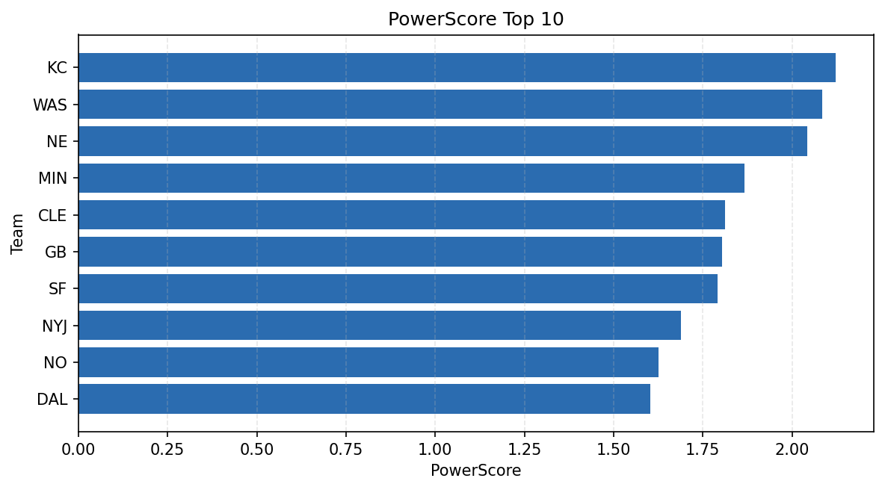

# Weekly Report - Season 2021, Week 10

_Generated at 2026-01-02T21:00:34.312305+00:00 (UTC)_

Data root: `data`

## Layer Shapes

| Layer | Artifact | Manifest | Rows | Columns | Status |
|-------|----------|----------|------|---------|--------|
| L1 Ingest | `data\l1\2021\10.parquet` | `data\l1\2021\10_manifest.json` | 2445 | 18 | ready |
| L2 Clean | `data\l2\2021\10.parquet` | `data\l2\2021\10_manifest.json` | 2445 | 24 | ready |
| L3 Team Week | `data\l3_team_week\2021\10.parquet` | `data\l3_team_week\2021\10_manifest.json` | 28 | 34 | ready |

## L2 Audit Snapshot

Last 3 entries from `data\l2_audit\2021\10_audit.jsonl`:

- {"step": "load", "details": "Loaded L1 parquet", "rows": 2445, "cols": 18, "timestamp": "2026-01-02T21:00:33.879951+00:00"}
- {"step": "prepare", "details": "Normalized team aliases, filtered season/week, deduplicated keys", "rows": 2445, "cols": 24, "rows_removed": 0, "timestamp": "2026-01-02T21:00:33.879951+00:00"}
- {"step": "validate", "details": "Validated against L2 contract and guardrails", "rows": 2445, "cols": 24, "timestamp": "2026-01-02T21:00:33.879951+00:00"}

## L3 Sanity

- Rows processed: 28
- Columns available: 34
- Artifact path: `data\l3_team_week\2021\10.parquet`

## Metrics Snapshot

### L4 Core12 Preview

- Artifact: `data\l4_core12\2021\10.parquet`
- Manifest: `data\l4_core12\2021\10_manifest.json`
- Rows: 28
- Columns: 27

| TEAM | core_epa_off | core_sr_off | core_sr_def |
| --- | --- | --- | --- |
| NE | 0.4066852009855211 | 0.5875 | 0.4266666666666667 |
| BUF | 0.29978105250425086 | 0.5405405405405406 | 0.37894736842105264 |
| KC | 0.2812343165666486 | 0.5208333333333334 | 0.3194444444444444 |
| SF | 0.1405691492724715 | 0.4578313253012048 | 0.36619718309859156 |
| DAL | 0.12212110091481478 | 0.41935483870967744 | 0.2753623188405797 |

### PowerScore Rankings

- Artifact: `data\l4_powerscore\2021\10.parquet`
- Manifest: `data\l4_powerscore\2021\10_manifest.json`
- Rows: 28
- Columns: 4

| team | power_score |
| --- | --- |
| KC | 2.123158197713007 |
| WAS | 2.0850975813191255 |
| NE | 2.042191238491589 |
| MIN | 1.8657861613985502 |
| CLE | 1.8112679941759757 |
| GB | 1.803091083343717 |
| SF | 1.7907746709324204 |
| NYJ | 1.688642844519835 |
| NO | 1.625817404083397 |
| DAL | 1.6022179130817684 |

## Visualizations

