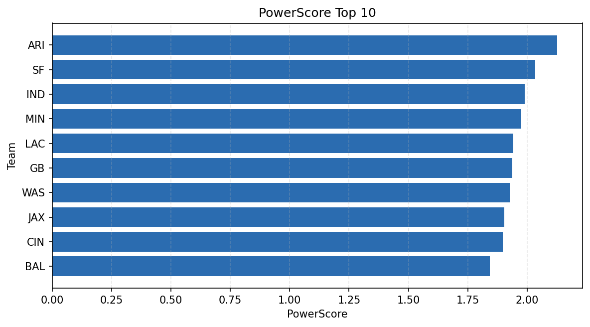

# Weekly Report - Season 2021, Week 11

_Generated at 2026-01-08T19:37:15.380079+00:00 (UTC)_

Data root: `data`

## Layer Shapes

| Layer | Artifact | Manifest | Rows | Columns | Status |
|-------|----------|----------|------|---------|--------|
| L1 Ingest | `data\l1\2021\11.parquet` | `data\l1\2021\11_manifest.json` | 2592 | 18 | ready |
| L2 Clean | `data\l2\2021\11.parquet` | `data\l2\2021\11_manifest.json` | 2592 | 24 | ready |
| L3 Team Week | `data\l3_team_week\2021\11.parquet` | `data\l3_team_week\2021\11_manifest.json` | 30 | 34 | ready |

## L2 Audit Snapshot

Last 3 entries from `data\l2_audit\2021\11_audit.jsonl`:

- {"step": "load", "details": "Loaded L1 parquet", "rows": 2592, "cols": 18, "timestamp": "2026-01-08T19:37:14.928686+00:00"}
- {"step": "prepare", "details": "Normalized team aliases, filtered season/week, deduplicated keys", "rows": 2592, "cols": 24, "rows_removed": 0, "timestamp": "2026-01-08T19:37:14.928686+00:00"}
- {"step": "validate", "details": "Validated against L2 contract and guardrails", "rows": 2592, "cols": 24, "timestamp": "2026-01-08T19:37:14.928686+00:00"}

## L3 Sanity

- Rows processed: 30
- Columns available: 34
- Artifact path: `data\l3_team_week\2021\11.parquet`

## Metrics Snapshot

### L4 Core12 Preview

- Artifact: `data\l4_core12\2021\11.parquet`
- Manifest: `data\l4_core12\2021\11_manifest.json`
- Rows: 30
- Columns: 27

| TEAM | core_epa_off | core_sr_off | core_sr_def |
| --- | --- | --- | --- |
| SF | 0.2749912121742055 | 0.5121951219512195 | 0.4032258064516129 |
| IND | 0.2536238091767846 | 0.5555555555555556 | 0.4657534246575342 |
| GB | 0.25074844869883045 | 0.4473684210526316 | 0.47674418604651164 |
| MIN | 0.2471565044333422 | 0.47674418604651164 | 0.4473684210526316 |
| WAS | 0.14451098930219125 | 0.4942528735632184 | 0.45454545454545453 |

### PowerScore Rankings

- Artifact: `data\l4_powerscore\2021\11.parquet`
- Manifest: `data\l4_powerscore\2021\11_manifest.json`
- Rows: 30
- Columns: 4

| team | power_score |
| --- | --- |
| ARI | 2.127241811990865 |
| SF | 2.0334014907596667 |
| IND | 1.9906174340385259 |
| MIN | 1.9758405128030638 |
| LAC | 1.9407901397800007 |
| GB | 1.937924252083306 |
| WAS | 1.92782517142081 |
| JAX | 1.9042795021064847 |
| CIN | 1.8984359766656222 |
| BAL | 1.8422886402358545 |

## Visualizations

