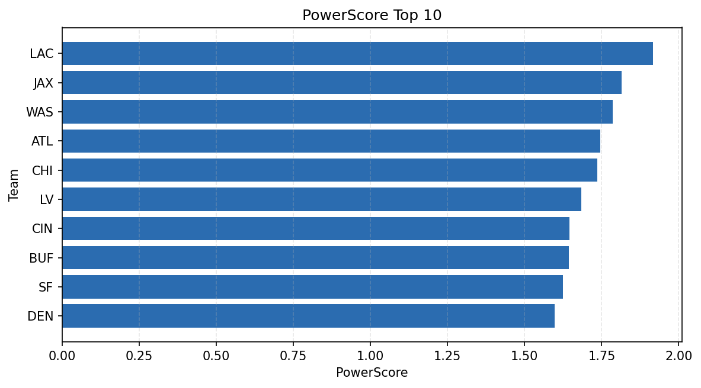

# Weekly Report - Season 2021, Week 12

_Generated at 2026-01-08T19:38:11.230144+00:00 (UTC)_

Data root: `data`

## Layer Shapes

| Layer | Artifact | Manifest | Rows | Columns | Status |
|-------|----------|----------|------|---------|--------|
| L1 Ingest | `data\l1\2021\12.parquet` | `data\l1\2021\12_manifest.json` | 2612 | 18 | ready |
| L2 Clean | `data\l2\2021\12.parquet` | `data\l2\2021\12_manifest.json` | 2612 | 24 | ready |
| L3 Team Week | `data\l3_team_week\2021\12.parquet` | `data\l3_team_week\2021\12_manifest.json` | 30 | 34 | ready |

## L2 Audit Snapshot

Last 3 entries from `data\l2_audit\2021\12_audit.jsonl`:

- {"step": "load", "details": "Loaded L1 parquet", "rows": 2612, "cols": 18, "timestamp": "2026-01-08T19:38:10.795865+00:00"}
- {"step": "prepare", "details": "Normalized team aliases, filtered season/week, deduplicated keys", "rows": 2612, "cols": 24, "rows_removed": 0, "timestamp": "2026-01-08T19:38:10.795865+00:00"}
- {"step": "validate", "details": "Validated against L2 contract and guardrails", "rows": 2612, "cols": 24, "timestamp": "2026-01-08T19:38:10.795865+00:00"}

## L3 Sanity

- Rows processed: 30
- Columns available: 34
- Artifact path: `data\l3_team_week\2021\12.parquet`

## Metrics Snapshot

### L4 Core12 Preview

- Artifact: `data\l4_core12\2021\12.parquet`
- Manifest: `data\l4_core12\2021\12_manifest.json`
- Rows: 30
- Columns: 27

| TEAM | core_epa_off | core_sr_off | core_sr_def |
| --- | --- | --- | --- |
| NE | 0.22989606097139217 | 0.5 | 0.41975308641975306 |
| CIN | 0.15932179351213827 | 0.5421686746987951 | 0.32051282051282054 |
| LV | 0.14719573970426592 | 0.39473684210526316 | 0.41414141414141414 |
| TB | 0.14656754156355473 | 0.6 | 0.4659090909090909 |
| BUF | 0.08131023711309983 | 0.5128205128205128 | 0.2191780821917808 |

### PowerScore Rankings

- Artifact: `data\l4_powerscore\2021\12.parquet`
- Manifest: `data\l4_powerscore\2021\12_manifest.json`
- Rows: 30
- Columns: 4

| team | power_score |
| --- | --- |
| LAC | 1.915726624739011 |
| JAX | 1.815018342213608 |
| WAS | 1.786565069677479 |
| ATL | 1.7449436111388168 |
| CHI | 1.7353007759790318 |
| LV | 1.6838737499775789 |
| CIN | 1.6456828410713993 |
| BUF | 1.6442903256561237 |
| SF | 1.6241896016548607 |
| DEN | 1.5977446880807593 |

## Visualizations

