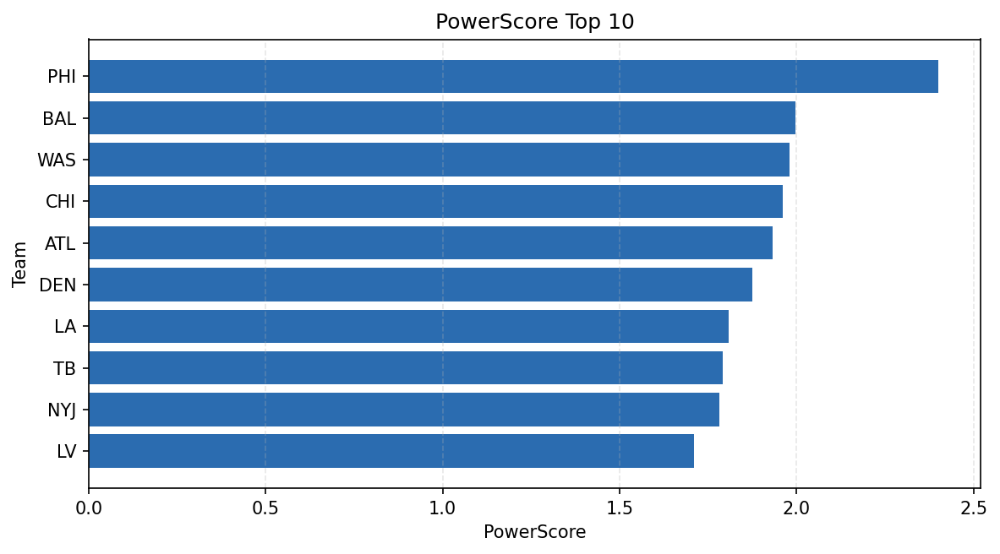

# Weekly Report - Season 2021, Week 13

_Generated at 2026-01-02T21:03:21.410888+00:00 (UTC)_

Data root: `data`

## Layer Shapes

| Layer | Artifact | Manifest | Rows | Columns | Status |
|-------|----------|----------|------|---------|--------|
| L1 Ingest | `data\l1\2021\13.parquet` | `data\l1\2021\13_manifest.json` | 2435 | 18 | ready |
| L2 Clean | `data\l2\2021\13.parquet` | `data\l2\2021\13_manifest.json` | 2435 | 24 | ready |
| L3 Team Week | `data\l3_team_week\2021\13.parquet` | `data\l3_team_week\2021\13_manifest.json` | 28 | 34 | ready |

## L2 Audit Snapshot

Last 3 entries from `data\l2_audit\2021\13_audit.jsonl`:

- {"step": "load", "details": "Loaded L1 parquet", "rows": 2435, "cols": 18, "timestamp": "2026-01-02T21:03:20.926135+00:00"}
- {"step": "prepare", "details": "Normalized team aliases, filtered season/week, deduplicated keys", "rows": 2435, "cols": 24, "rows_removed": 0, "timestamp": "2026-01-02T21:03:20.926135+00:00"}
- {"step": "validate", "details": "Validated against L2 contract and guardrails", "rows": 2435, "cols": 24, "timestamp": "2026-01-02T21:03:20.926135+00:00"}

## L3 Sanity

- Rows processed: 28
- Columns available: 34
- Artifact path: `data\l3_team_week\2021\13.parquet`

## Metrics Snapshot

### L4 Core12 Preview

- Artifact: `data\l4_core12\2021\13.parquet`
- Manifest: `data\l4_core12\2021\13_manifest.json`
- Rows: 28
- Columns: 27

| TEAM | core_epa_off | core_sr_off | core_sr_def |
| --- | --- | --- | --- |
| PHI | 0.25679452383312684 | 0.5172413793103449 | 0.3972602739726027 |
| LA | 0.22733898185727344 | 0.5365853658536586 | 0.3466666666666667 |
| TB | 0.14657500645191204 | 0.45121951219512196 | 0.4175824175824176 |
| ARI | 0.12925974813465407 | 0.4927536231884058 | 0.40860215053763443 |
| PIT | 0.0758947071308891 | 0.4666666666666667 | 0.3978494623655914 |

### PowerScore Rankings

- Artifact: `data\l4_powerscore\2021\13.parquet`
- Manifest: `data\l4_powerscore\2021\13_manifest.json`
- Rows: 28
- Columns: 4

| team | power_score |
| --- | --- |
| PHI | 2.3998703609173613 |
| BAL | 1.9979194750570475 |
| WAS | 1.9789622781518927 |
| CHI | 1.960363073558227 |
| ATL | 1.9326937519247724 |
| DEN | 1.8743217255019025 |
| LA | 1.8079291058988556 |
| TB | 1.7920964995862556 |
| NYJ | 1.7828395777913142 |
| LV | 1.7113133854069862 |

## Visualizations

