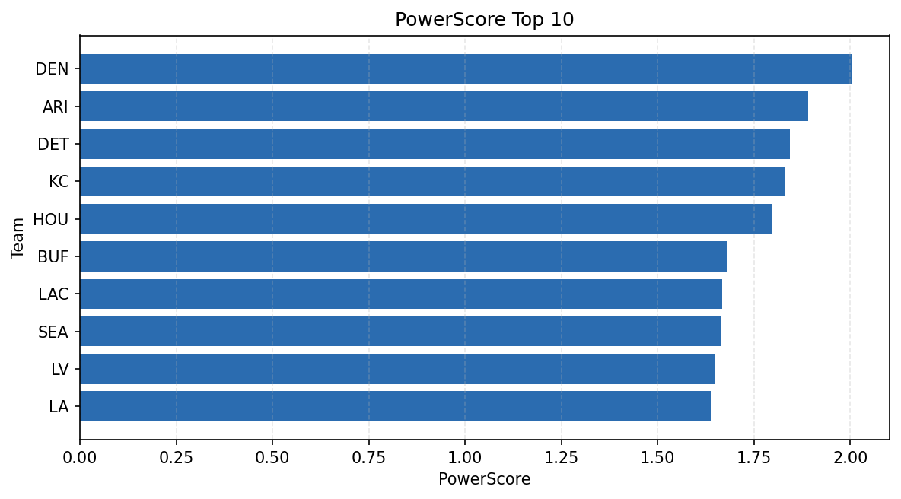

# Weekly Report - Season 2021, Week 14

_Generated at 2026-01-08T19:40:12.059024+00:00 (UTC)_

Data root: `data`

## Layer Shapes

| Layer | Artifact | Manifest | Rows | Columns | Status |
|-------|----------|----------|------|---------|--------|
| L1 Ingest | `data\l1\2021\14.parquet` | `data\l1\2021\14_manifest.json` | 2560 | 18 | ready |
| L2 Clean | `data\l2\2021\14.parquet` | `data\l2\2021\14_manifest.json` | 2560 | 24 | ready |
| L3 Team Week | `data\l3_team_week\2021\14.parquet` | `data\l3_team_week\2021\14_manifest.json` | 28 | 34 | ready |

## L2 Audit Snapshot

Last 3 entries from `data\l2_audit\2021\14_audit.jsonl`:

- {"step": "load", "details": "Loaded L1 parquet", "rows": 2560, "cols": 18, "timestamp": "2026-01-08T19:40:11.574594+00:00"}
- {"step": "prepare", "details": "Normalized team aliases, filtered season/week, deduplicated keys", "rows": 2560, "cols": 24, "rows_removed": 0, "timestamp": "2026-01-08T19:40:11.574594+00:00"}
- {"step": "validate", "details": "Validated against L2 contract and guardrails", "rows": 2560, "cols": 24, "timestamp": "2026-01-08T19:40:11.574594+00:00"}

## L3 Sanity

- Rows processed: 28
- Columns available: 34
- Artifact path: `data\l3_team_week\2021\14.parquet`

## Metrics Snapshot

### L4 Core12 Preview

- Artifact: `data\l4_core12\2021\14.parquet`
- Manifest: `data\l4_core12\2021\14_manifest.json`
- Rows: 28
- Columns: 27

| TEAM | core_epa_off | core_sr_off | core_sr_def |
| --- | --- | --- | --- |
| KC | 0.33022561608986173 | 0.5679012345679012 | 0.41025641025641024 |
| DEN | 0.2514650314402433 | 0.5555555555555556 | 0.41025641025641024 |
| SEA | 0.21474538066113988 | 0.44 | 0.42574257425742573 |
| LA | 0.14406818866327004 | 0.44594594594594594 | 0.422680412371134 |
| TB | 0.14252683079308448 | 0.46078431372549017 | 0.4897959183673469 |

### PowerScore Rankings

- Artifact: `data\l4_powerscore\2021\14.parquet`
- Manifest: `data\l4_powerscore\2021\14_manifest.json`
- Rows: 28
- Columns: 4

| team | power_score |
| --- | --- |
| DEN | 2.0027740971773422 |
| ARI | 1.8909984749305555 |
| DET | 1.8439672249331291 |
| KC | 1.8308403132047908 |
| HOU | 1.797486202386603 |
| BUF | 1.6821430801404154 |
| LAC | 1.668243545619821 |
| SEA | 1.6650283971495048 |
| LV | 1.6468597939119614 |
| LA | 1.637840849929348 |

## Visualizations

