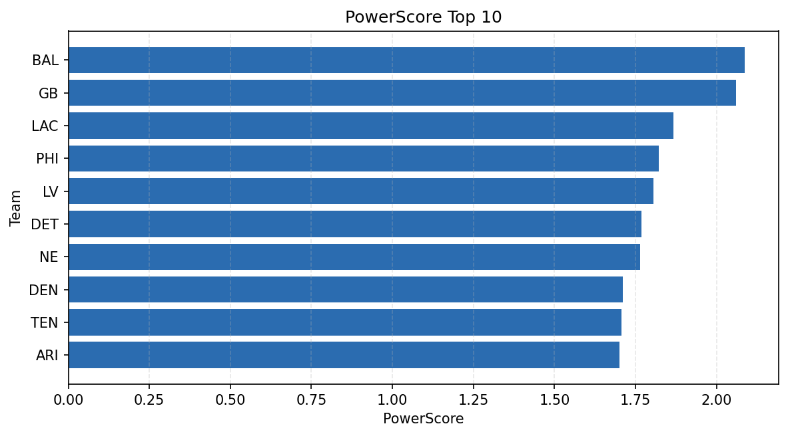

# Weekly Report - Season 2021, Week 15

_Generated at 2026-01-02T21:05:26.791389+00:00 (UTC)_

Data root: `data`

## Layer Shapes

| Layer | Artifact | Manifest | Rows | Columns | Status |
|-------|----------|----------|------|---------|--------|
| L1 Ingest | `data\l1\2021\15.parquet` | `data\l1\2021\15_manifest.json` | 2773 | 18 | ready |
| L2 Clean | `data\l2\2021\15.parquet` | `data\l2\2021\15_manifest.json` | 2773 | 24 | ready |
| L3 Team Week | `data\l3_team_week\2021\15.parquet` | `data\l3_team_week\2021\15_manifest.json` | 32 | 34 | ready |

## L2 Audit Snapshot

Last 3 entries from `data\l2_audit\2021\15_audit.jsonl`:

- {"step": "load", "details": "Loaded L1 parquet", "rows": 2773, "cols": 18, "timestamp": "2026-01-02T21:05:26.310598+00:00"}
- {"step": "prepare", "details": "Normalized team aliases, filtered season/week, deduplicated keys", "rows": 2773, "cols": 24, "rows_removed": 0, "timestamp": "2026-01-02T21:05:26.310598+00:00"}
- {"step": "validate", "details": "Validated against L2 contract and guardrails", "rows": 2773, "cols": 24, "timestamp": "2026-01-02T21:05:26.310598+00:00"}

## L3 Sanity

- Rows processed: 32
- Columns available: 34
- Artifact path: `data\l3_team_week\2021\15.parquet`

## Metrics Snapshot

### L4 Core12 Preview

- Artifact: `data\l4_core12\2021\15.parquet`
- Manifest: `data\l4_core12\2021\15_manifest.json`
- Rows: 32
- Columns: 27

| TEAM | core_epa_off | core_sr_off | core_sr_def |
| --- | --- | --- | --- |
| GB | 0.2116435462120557 | 0.524390243902439 | 0.4880952380952381 |
| BAL | 0.1602143158171592 | 0.4880952380952381 | 0.524390243902439 |
| KC | 0.13992192538543827 | 0.4642857142857143 | 0.46808510638297873 |
| SF | 0.11809583060758215 | 0.4788732394366197 | 0.3924050632911392 |
| HOU | 0.10182680427745174 | 0.4177215189873418 | 0.3563218390804598 |

### PowerScore Rankings

- Artifact: `data\l4_powerscore\2021\15.parquet`
- Manifest: `data\l4_powerscore\2021\15_manifest.json`
- Rows: 32
- Columns: 4

| team | power_score |
| --- | --- |
| BAL | 2.087094195968893 |
| GB | 2.0594378875354833 |
| LAC | 1.8662175649431916 |
| PHI | 1.8228378108332322 |
| LV | 1.8054009524645784 |
| DET | 1.7689630949853545 |
| NE | 1.7649465734735832 |
| DEN | 1.7113231456562983 |
| TEN | 1.7068031189256156 |
| ARI | 1.7003752412364854 |

## Visualizations

