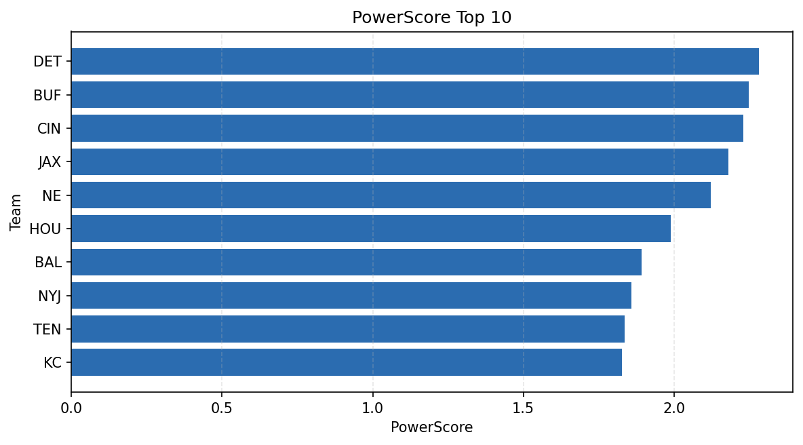

# Weekly Report - Season 2021, Week 16

_Generated at 2026-01-02T21:06:14.122536+00:00 (UTC)_

Data root: `data`

## Layer Shapes

| Layer | Artifact | Manifest | Rows | Columns | Status |
|-------|----------|----------|------|---------|--------|
| L1 Ingest | `data\l1\2021\16.parquet` | `data\l1\2021\16_manifest.json` | 2728 | 18 | ready |
| L2 Clean | `data\l2\2021\16.parquet` | `data\l2\2021\16_manifest.json` | 2728 | 24 | ready |
| L3 Team Week | `data\l3_team_week\2021\16.parquet` | `data\l3_team_week\2021\16_manifest.json` | 32 | 34 | ready |

## L2 Audit Snapshot

Last 3 entries from `data\l2_audit\2021\16_audit.jsonl`:

- {"step": "load", "details": "Loaded L1 parquet", "rows": 2728, "cols": 18, "timestamp": "2026-01-02T21:06:13.681060+00:00"}
- {"step": "prepare", "details": "Normalized team aliases, filtered season/week, deduplicated keys", "rows": 2728, "cols": 24, "rows_removed": 0, "timestamp": "2026-01-02T21:06:13.681060+00:00"}
- {"step": "validate", "details": "Validated against L2 contract and guardrails", "rows": 2728, "cols": 24, "timestamp": "2026-01-02T21:06:13.681060+00:00"}

## L3 Sanity

- Rows processed: 32
- Columns available: 34
- Artifact path: `data\l3_team_week\2021\16.parquet`

## Metrics Snapshot

### L4 Core12 Preview

- Artifact: `data\l4_core12\2021\16.parquet`
- Manifest: `data\l4_core12\2021\16_manifest.json`
- Rows: 32
- Columns: 27

| TEAM | core_epa_off | core_sr_off | core_sr_def |
| --- | --- | --- | --- |
| DAL | 0.2908382820172442 | 0.5111111111111111 | 0.3291139240506329 |
| CIN | 0.27920292181273304 | 0.5 | 0.44155844155844154 |
| BUF | 0.2480458467693457 | 0.5164835164835165 | 0.4230769230769231 |
| HOU | 0.2126571543179871 | 0.4606741573033708 | 0.581081081081081 |
| NYJ | 0.1761059980474513 | 0.5135135135135135 | 0.4943820224719101 |

### PowerScore Rankings

- Artifact: `data\l4_powerscore\2021\16.parquet`
- Manifest: `data\l4_powerscore\2021\16_manifest.json`
- Rows: 32
- Columns: 4

| team | power_score |
| --- | --- |
| DET | 2.281018151086033 |
| BUF | 2.2482745870711844 |
| CIN | 2.2307628345914443 |
| JAX | 2.1795542337252 |
| NE | 2.1230804190010213 |
| HOU | 1.9892539401717584 |
| BAL | 1.8914144767879968 |
| NYJ | 1.8590083511222617 |
| TEN | 1.8350300578209453 |
| KC | 1.8260935756669663 |

## Visualizations

