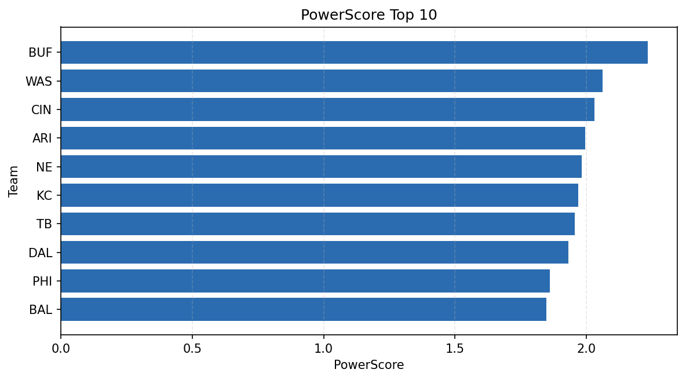

# Weekly Report - Season 2021, Week 17

_Generated at 2026-01-08T19:43:36.430832+00:00 (UTC)_

Data root: `data`

## Layer Shapes

| Layer | Artifact | Manifest | Rows | Columns | Status |
|-------|----------|----------|------|---------|--------|
| L1 Ingest | `data\l1\2021\17.parquet` | `data\l1\2021\17_manifest.json` | 2722 | 18 | ready |
| L2 Clean | `data\l2\2021\17.parquet` | `data\l2\2021\17_manifest.json` | 2722 | 24 | ready |
| L3 Team Week | `data\l3_team_week\2021\17.parquet` | `data\l3_team_week\2021\17_manifest.json` | 32 | 34 | ready |

## L2 Audit Snapshot

Last 3 entries from `data\l2_audit\2021\17_audit.jsonl`:

- {"step": "load", "details": "Loaded L1 parquet", "rows": 2722, "cols": 18, "timestamp": "2026-01-08T19:43:36.015305+00:00"}
- {"step": "prepare", "details": "Normalized team aliases, filtered season/week, deduplicated keys", "rows": 2722, "cols": 24, "rows_removed": 0, "timestamp": "2026-01-08T19:43:36.015305+00:00"}
- {"step": "validate", "details": "Validated against L2 contract and guardrails", "rows": 2722, "cols": 24, "timestamp": "2026-01-08T19:43:36.015305+00:00"}

## L3 Sanity

- Rows processed: 32
- Columns available: 34
- Artifact path: `data\l3_team_week\2021\17.parquet`

## Metrics Snapshot

### L4 Core12 Preview

- Artifact: `data\l4_core12\2021\17.parquet`
- Manifest: `data\l4_core12\2021\17_manifest.json`
- Rows: 32
- Columns: 27

| TEAM | core_epa_off | core_sr_off | core_sr_def |
| --- | --- | --- | --- |
| NE | 0.32742246121845464 | 0.625 | 0.3333333333333333 |
| SEA | 0.2701718032360077 | 0.5888888888888889 | 0.4146341463414634 |
| KC | 0.26041556063941435 | 0.5657894736842105 | 0.4606741573033708 |
| CIN | 0.23489466547610216 | 0.4606741573033708 | 0.5657894736842105 |
| LAC | 0.20647100747827393 | 0.5185185185185185 | 0.44 |

### PowerScore Rankings

- Artifact: `data\l4_powerscore\2021\17.parquet`
- Manifest: `data\l4_powerscore\2021\17_manifest.json`
- Rows: 32
- Columns: 4

| team | power_score |
| --- | --- |
| BUF | 2.2338229495188653 |
| WAS | 2.0606610048951444 |
| CIN | 2.0294647843703615 |
| ARI | 1.9953217750934242 |
| NE | 1.981338719909159 |
| KC | 1.9684606366289572 |
| TB | 1.9541365440069773 |
| DAL | 1.9301547134948627 |
| PHI | 1.860564661340334 |
| BAL | 1.8463462506304407 |

## Visualizations

