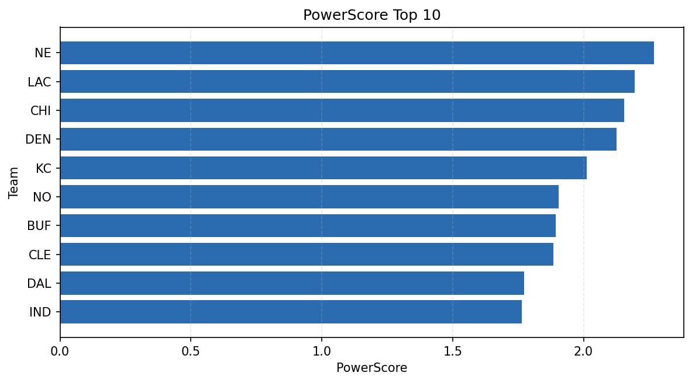

# Weekly Report - Season 2021, Week 1

_Generated at 2026-01-02T20:53:49.356405+00:00 (UTC)_

Data root: `data`

## Layer Shapes

| Layer | Artifact | Manifest | Rows | Columns | Status |
|-------|----------|----------|------|---------|--------|
| L1 Ingest | `data\l1\2021\1.parquet` | `data\l1\2021\1_manifest.json` | 2878 | 18 | ready |
| L2 Clean | `data\l2\2021\1.parquet` | `data\l2\2021\1_manifest.json` | 2878 | 24 | ready |
| L3 Team Week | `data\l3_team_week\2021\1.parquet` | `data\l3_team_week\2021\1_manifest.json` | 32 | 34 | ready |

## L2 Audit Snapshot

Last 3 entries from `data\l2_audit\2021\1_audit.jsonl`:

- {"step": "load", "details": "Loaded L1 parquet", "rows": 2878, "cols": 18, "timestamp": "2026-01-02T20:53:48.794118+00:00"}
- {"step": "prepare", "details": "Normalized team aliases, filtered season/week, deduplicated keys", "rows": 2878, "cols": 24, "rows_removed": 0, "timestamp": "2026-01-02T20:53:48.794118+00:00"}
- {"step": "validate", "details": "Validated against L2 contract and guardrails", "rows": 2878, "cols": 24, "timestamp": "2026-01-02T20:53:48.794118+00:00"}

## L3 Sanity

- Rows processed: 32
- Columns available: 34
- Artifact path: `data\l3_team_week\2021\1.parquet`

## Metrics Snapshot

### L4 Core12 Preview

- Artifact: `data\l4_core12\2021\1.parquet`
- Manifest: `data\l4_core12\2021\1_manifest.json`
- Rows: 32
- Columns: 27

| TEAM | core_epa_off | core_sr_off | core_sr_def |
| --- | --- | --- | --- |
| NO | 0.2736520437189402 | 0.5256410256410257 | 0.37681159420289856 |
| DEN | 0.2390238475840684 | 0.45454545454545453 | 0.4246575342465753 |
| KC | 0.23706890180474147 | 0.4625 | 0.5135135135135135 |
| LA | 0.21859173889343556 | 0.4461538461538462 | 0.49382716049382713 |
| CLE | 0.182527681969962 | 0.5135135135135135 | 0.4625 |

### PowerScore Rankings

- Artifact: `data\l4_powerscore\2021\1.parquet`
- Manifest: `data\l4_powerscore\2021\1_manifest.json`
- Rows: 32
- Columns: 4

| team | power_score |
| --- | --- |
| NE | 2.269274162394259 |
| LAC | 2.19595125985845 |
| CHI | 2.154862783023449 |
| DEN | 2.1265801716621695 |
| KC | 2.0128824298034296 |
| NO | 1.90514188394046 |
| BUF | 1.8931807423211835 |
| CLE | 1.8841212918732577 |
| DAL | 1.7741656698713841 |
| IND | 1.7644472875398354 |

## Visualizations

