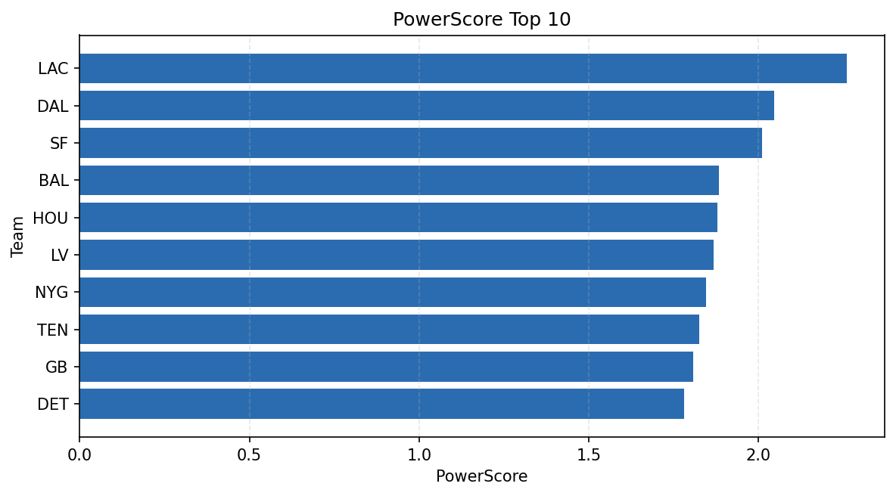

# Weekly Report - Season 2021, Week 2

_Generated at 2026-01-08T19:30:38.645497+00:00 (UTC)_

Data root: `data`

## Layer Shapes

| Layer | Artifact | Manifest | Rows | Columns | Status |
|-------|----------|----------|------|---------|--------|
| L1 Ingest | `data\l1\2021\2.parquet` | `data\l1\2021\2_manifest.json` | 2753 | 18 | ready |
| L2 Clean | `data\l2\2021\2.parquet` | `data\l2\2021\2_manifest.json` | 2753 | 24 | ready |
| L3 Team Week | `data\l3_team_week\2021\2.parquet` | `data\l3_team_week\2021\2_manifest.json` | 32 | 34 | ready |

## L2 Audit Snapshot

Last 3 entries from `data\l2_audit\2021\2_audit.jsonl`:

- {"step": "load", "details": "Loaded L1 parquet", "rows": 2753, "cols": 18, "timestamp": "2026-01-08T19:30:38.202621+00:00"}
- {"step": "prepare", "details": "Normalized team aliases, filtered season/week, deduplicated keys", "rows": 2753, "cols": 24, "rows_removed": 0, "timestamp": "2026-01-08T19:30:38.202621+00:00"}
- {"step": "validate", "details": "Validated against L2 contract and guardrails", "rows": 2753, "cols": 24, "timestamp": "2026-01-08T19:30:38.202621+00:00"}

## L3 Sanity

- Rows processed: 32
- Columns available: 34
- Artifact path: `data\l3_team_week\2021\2.parquet`

## Metrics Snapshot

### L4 Core12 Preview

- Artifact: `data\l4_core12\2021\2.parquet`
- Manifest: `data\l4_core12\2021\2_manifest.json`
- Rows: 32
- Columns: 27

| TEAM | core_epa_off | core_sr_off | core_sr_def |
| --- | --- | --- | --- |
| GB | 0.2342032690765336 | 0.5 | 0.5277777777777778 |
| KC | 0.18147093742919057 | 0.5522388059701493 | 0.532608695652174 |
| CLE | 0.17189960487901348 | 0.547945205479452 | 0.38461538461538464 |
| NYG | 0.1650329100397917 | 0.43956043956043955 | 0.5106382978723404 |
| LV | 0.15677493706434256 | 0.5119047619047619 | 0.3287671232876712 |

### PowerScore Rankings

- Artifact: `data\l4_powerscore\2021\2.parquet`
- Manifest: `data\l4_powerscore\2021\2_manifest.json`
- Rows: 32
- Columns: 4

| team | power_score |
| --- | --- |
| LAC | 2.2594096933726 |
| DAL | 2.047078452564849 |
| SF | 2.009648248362466 |
| BAL | 1.8838592091798678 |
| HOU | 1.878527181335124 |
| LV | 1.8670424125434537 |
| NYG | 1.8453796138091751 |
| TEN | 1.8257347623954876 |
| GB | 1.8075501332562676 |
| DET | 1.7797983291488426 |

## Visualizations

