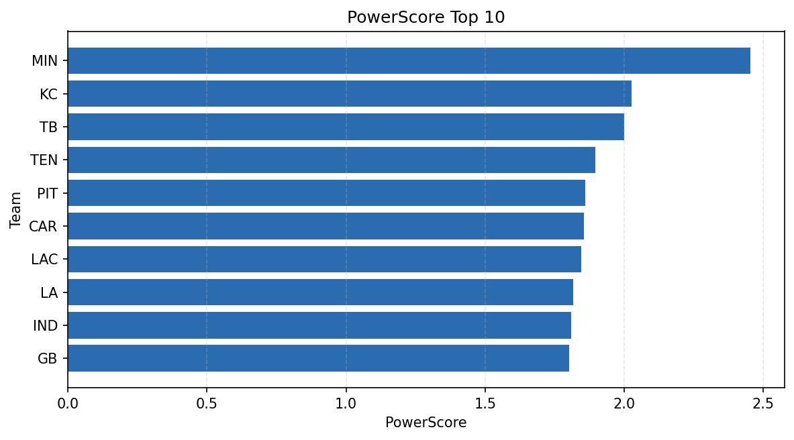

# Weekly Report - Season 2021, Week 3

_Generated at 2026-01-02T20:55:18.468406+00:00 (UTC)_

Data root: `data`

## Layer Shapes

| Layer | Artifact | Manifest | Rows | Columns | Status |
|-------|----------|----------|------|---------|--------|
| L1 Ingest | `data\l1\2021\3.parquet` | `data\l1\2021\3_manifest.json` | 2811 | 18 | ready |
| L2 Clean | `data\l2\2021\3.parquet` | `data\l2\2021\3_manifest.json` | 2811 | 24 | ready |
| L3 Team Week | `data\l3_team_week\2021\3.parquet` | `data\l3_team_week\2021\3_manifest.json` | 32 | 34 | ready |

## L2 Audit Snapshot

Last 3 entries from `data\l2_audit\2021\3_audit.jsonl`:

- {"step": "load", "details": "Loaded L1 parquet", "rows": 2811, "cols": 18, "timestamp": "2026-01-02T20:55:18.017198+00:00"}
- {"step": "prepare", "details": "Normalized team aliases, filtered season/week, deduplicated keys", "rows": 2811, "cols": 24, "rows_removed": 0, "timestamp": "2026-01-02T20:55:18.017198+00:00"}
- {"step": "validate", "details": "Validated against L2 contract and guardrails", "rows": 2811, "cols": 24, "timestamp": "2026-01-02T20:55:18.017198+00:00"}

## L3 Sanity

- Rows processed: 32
- Columns available: 34
- Artifact path: `data\l3_team_week\2021\3.parquet`

## Metrics Snapshot

### L4 Core12 Preview

- Artifact: `data\l4_core12\2021\3.parquet`
- Manifest: `data\l4_core12\2021\3_manifest.json`
- Rows: 32
- Columns: 27

| TEAM | core_epa_off | core_sr_off | core_sr_def |
| --- | --- | --- | --- |
| GB | 0.21372774321161495 | 0.4810126582278481 | 0.5 |
| MIN | 0.19381417568979992 | 0.4888888888888889 | 0.4925373134328358 |
| LA | 0.1754379705412359 | 0.4268292682926829 | 0.44565217391304346 |
| LAC | 0.1644252232017826 | 0.46987951807228917 | 0.532608695652174 |
| SF | 0.12837541233315025 | 0.5 | 0.4810126582278481 |

### PowerScore Rankings

- Artifact: `data\l4_powerscore\2021\3.parquet`
- Manifest: `data\l4_powerscore\2021\3_manifest.json`
- Rows: 32
- Columns: 4

| team | power_score |
| --- | --- |
| MIN | 2.453112323301872 |
| KC | 2.0259650624721606 |
| TB | 2.000555991875368 |
| TEN | 1.8968041804959084 |
| PIT | 1.8599567827028727 |
| CAR | 1.8547522281241804 |
| LAC | 1.8464060470208452 |
| LA | 1.816142237784809 |
| IND | 1.8079414378151595 |
| GB | 1.8007329571476574 |

## Visualizations

