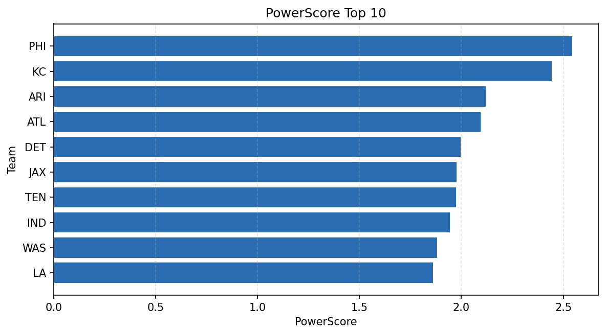

# Weekly Report - Season 2021, Week 4

_Generated at 2026-01-02T20:56:00.651055+00:00 (UTC)_

Data root: `data`

## Layer Shapes

| Layer | Artifact | Manifest | Rows | Columns | Status |
|-------|----------|----------|------|---------|--------|
| L1 Ingest | `data\l1\2021\4.parquet` | `data\l1\2021\4_manifest.json` | 2847 | 18 | ready |
| L2 Clean | `data\l2\2021\4.parquet` | `data\l2\2021\4_manifest.json` | 2847 | 24 | ready |
| L3 Team Week | `data\l3_team_week\2021\4.parquet` | `data\l3_team_week\2021\4_manifest.json` | 32 | 34 | ready |

## L2 Audit Snapshot

Last 3 entries from `data\l2_audit\2021\4_audit.jsonl`:

- {"step": "load", "details": "Loaded L1 parquet", "rows": 2847, "cols": 18, "timestamp": "2026-01-02T20:56:00.156388+00:00"}
- {"step": "prepare", "details": "Normalized team aliases, filtered season/week, deduplicated keys", "rows": 2847, "cols": 24, "rows_removed": 0, "timestamp": "2026-01-02T20:56:00.156388+00:00"}
- {"step": "validate", "details": "Validated against L2 contract and guardrails", "rows": 2847, "cols": 24, "timestamp": "2026-01-02T20:56:00.156388+00:00"}

## L3 Sanity

- Rows processed: 32
- Columns available: 34
- Artifact path: `data\l3_team_week\2021\4.parquet`

## Metrics Snapshot

### L4 Core12 Preview

- Artifact: `data\l4_core12\2021\4.parquet`
- Manifest: `data\l4_core12\2021\4_manifest.json`
- Rows: 32
- Columns: 27

| TEAM | core_epa_off | core_sr_off | core_sr_def |
| --- | --- | --- | --- |
| KC | 0.3754313226460534 | 0.5882352941176471 | 0.5054945054945055 |
| WAS | 0.23319756477532616 | 0.4578313253012048 | 0.42105263157894735 |
| ARI | 0.21603520427985737 | 0.5208333333333334 | 0.5176470588235295 |
| PHI | 0.19529859989799642 | 0.5054945054945055 | 0.5882352941176471 |
| IND | 0.18267758570569145 | 0.45454545454545453 | 0.391304347826087 |

### PowerScore Rankings

- Artifact: `data\l4_powerscore\2021\4.parquet`
- Manifest: `data\l4_powerscore\2021\4_manifest.json`
- Rows: 32
- Columns: 4

| team | power_score |
| --- | --- |
| PHI | 2.5448144008671356 |
| KC | 2.4425195064351297 |
| ARI | 2.1195456355186773 |
| ATL | 2.093135888481465 |
| DET | 1.9954972836160296 |
| JAX | 1.9770522390292464 |
| TEN | 1.9739086947410929 |
| IND | 1.9447907845688355 |
| WAS | 1.8796388176433299 |
| LA | 1.8616375217647934 |

## Visualizations

