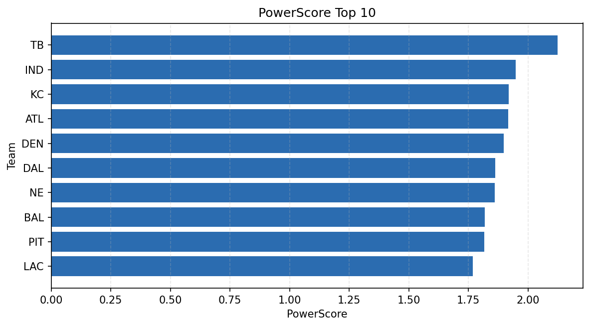

# Weekly Report - Season 2021, Week 5

_Generated at 2026-01-02T20:56:43.258110+00:00 (UTC)_

Data root: `data`

## Layer Shapes

| Layer | Artifact | Manifest | Rows | Columns | Status |
|-------|----------|----------|------|---------|--------|
| L1 Ingest | `data\l1\2021\5.parquet` | `data\l1\2021\5_manifest.json` | 2849 | 18 | ready |
| L2 Clean | `data\l2\2021\5.parquet` | `data\l2\2021\5_manifest.json` | 2849 | 24 | ready |
| L3 Team Week | `data\l3_team_week\2021\5.parquet` | `data\l3_team_week\2021\5_manifest.json` | 32 | 34 | ready |

## L2 Audit Snapshot

Last 3 entries from `data\l2_audit\2021\5_audit.jsonl`:

- {"step": "load", "details": "Loaded L1 parquet", "rows": 2849, "cols": 18, "timestamp": "2026-01-02T20:56:42.419088+00:00"}
- {"step": "prepare", "details": "Normalized team aliases, filtered season/week, deduplicated keys", "rows": 2849, "cols": 24, "rows_removed": 0, "timestamp": "2026-01-02T20:56:42.419088+00:00"}
- {"step": "validate", "details": "Validated against L2 contract and guardrails", "rows": 2849, "cols": 24, "timestamp": "2026-01-02T20:56:42.419088+00:00"}

## L3 Sanity

- Rows processed: 32
- Columns available: 34
- Artifact path: `data\l3_team_week\2021\5.parquet`

## Metrics Snapshot

### L4 Core12 Preview

- Artifact: `data\l4_core12\2021\5.parquet`
- Manifest: `data\l4_core12\2021\5_manifest.json`
- Rows: 32
- Columns: 27

| TEAM | core_epa_off | core_sr_off | core_sr_def |
| --- | --- | --- | --- |
| TB | 0.33963677720467167 | 0.5698924731182796 | 0.42857142857142855 |
| LAC | 0.22840528133054894 | 0.40860215053763443 | 0.4725274725274725 |
| BAL | 0.21703377418046774 | 0.5697674418604651 | 0.47674418604651164 |
| BUF | 0.2000879204416698 | 0.44594594594594594 | 0.4953271028037383 |
| DAL | 0.18741041292706806 | 0.5053763440860215 | 0.38636363636363635 |

### PowerScore Rankings

- Artifact: `data\l4_powerscore\2021\5.parquet`
- Manifest: `data\l4_powerscore\2021\5_manifest.json`
- Rows: 32
- Columns: 4

| team | power_score |
| --- | --- |
| TB | 2.124295659284469 |
| IND | 1.9475731475503986 |
| KC | 1.918588740721215 |
| ATL | 1.9164807856482877 |
| DEN | 1.8979933143568326 |
| DAL | 1.8621684857408212 |
| NE | 1.8616106334728277 |
| BAL | 1.8191716714661734 |
| PIT | 1.816312065552227 |
| LAC | 1.7693041864544596 |

## Visualizations

