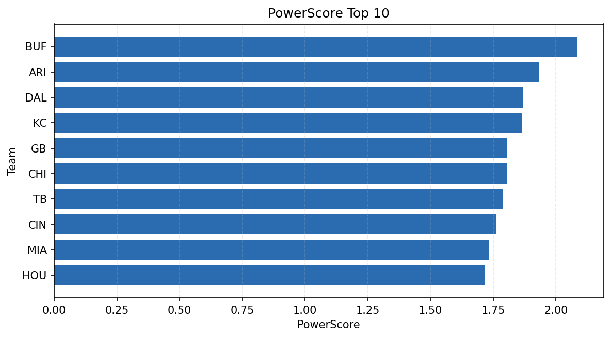

# Weekly Report - Season 2021, Week 6

_Generated at 2026-01-02T20:57:24.515028+00:00 (UTC)_

Data root: `data`

## Layer Shapes

| Layer | Artifact | Manifest | Rows | Columns | Status |
|-------|----------|----------|------|---------|--------|
| L1 Ingest | `data\l1\2021\6.parquet` | `data\l1\2021\6_manifest.json` | 2491 | 18 | ready |
| L2 Clean | `data\l2\2021\6.parquet` | `data\l2\2021\6_manifest.json` | 2491 | 24 | ready |
| L3 Team Week | `data\l3_team_week\2021\6.parquet` | `data\l3_team_week\2021\6_manifest.json` | 28 | 34 | ready |

## L2 Audit Snapshot

Last 3 entries from `data\l2_audit\2021\6_audit.jsonl`:

- {"step": "load", "details": "Loaded L1 parquet", "rows": 2491, "cols": 18, "timestamp": "2026-01-02T20:57:24.043360+00:00"}
- {"step": "prepare", "details": "Normalized team aliases, filtered season/week, deduplicated keys", "rows": 2491, "cols": 24, "rows_removed": 0, "timestamp": "2026-01-02T20:57:24.043360+00:00"}
- {"step": "validate", "details": "Validated against L2 contract and guardrails", "rows": 2491, "cols": 24, "timestamp": "2026-01-02T20:57:24.043360+00:00"}

## L3 Sanity

- Rows processed: 28
- Columns available: 34
- Artifact path: `data\l3_team_week\2021\6.parquet`

## Metrics Snapshot

### L4 Core12 Preview

- Artifact: `data\l4_core12\2021\6.parquet`
- Manifest: `data\l4_core12\2021\6_manifest.json`
- Rows: 28
- Columns: 27

| TEAM | core_epa_off | core_sr_off | core_sr_def |
| --- | --- | --- | --- |
| IND | 0.20512102222040532 | 0.4603174603174603 | 0.37362637362637363 |
| GB | 0.2026723347759495 | 0.5138888888888888 | 0.44594594594594594 |
| TEN | 0.19647726284650466 | 0.4861111111111111 | 0.46808510638297873 |
| CIN | 0.1748104439839051 | 0.4606741573033708 | 0.3375 |
| ARI | 0.17351554532845814 | 0.4666666666666667 | 0.3472222222222222 |

### PowerScore Rankings

- Artifact: `data\l4_powerscore\2021\6.parquet`
- Manifest: `data\l4_powerscore\2021\6_manifest.json`
- Rows: 28
- Columns: 4

| team | power_score |
| --- | --- |
| BUF | 2.0850090027028525 |
| ARI | 1.9325200905927664 |
| DAL | 1.869683810578974 |
| KC | 1.866023305277065 |
| GB | 1.8031621661066923 |
| CHI | 1.8030359946336743 |
| TB | 1.7882834302542234 |
| CIN | 1.7601664875223888 |
| MIA | 1.734274956615268 |
| HOU | 1.7169179004564419 |

## Visualizations

