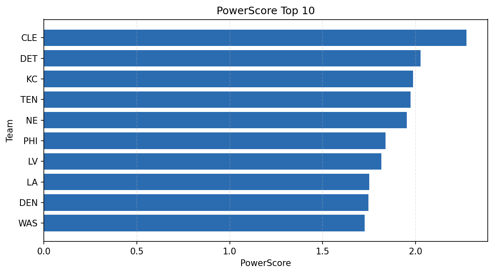

# Weekly Report - Season 2021, Week 7

_Generated at 2026-01-08T19:33:58.612854+00:00 (UTC)_

Data root: `data`

## Layer Shapes

| Layer | Artifact | Manifest | Rows | Columns | Status |
|-------|----------|----------|------|---------|--------|
| L1 Ingest | `data\l1\2021\7.parquet` | `data\l1\2021\7_manifest.json` | 2235 | 18 | ready |
| L2 Clean | `data\l2\2021\7.parquet` | `data\l2\2021\7_manifest.json` | 2235 | 24 | ready |
| L3 Team Week | `data\l3_team_week\2021\7.parquet` | `data\l3_team_week\2021\7_manifest.json` | 26 | 34 | ready |

## L2 Audit Snapshot

Last 3 entries from `data\l2_audit\2021\7_audit.jsonl`:

- {"step": "load", "details": "Loaded L1 parquet", "rows": 2235, "cols": 18, "timestamp": "2026-01-08T19:33:58.202011+00:00"}
- {"step": "prepare", "details": "Normalized team aliases, filtered season/week, deduplicated keys", "rows": 2235, "cols": 24, "rows_removed": 0, "timestamp": "2026-01-08T19:33:58.202011+00:00"}
- {"step": "validate", "details": "Validated against L2 contract and guardrails", "rows": 2235, "cols": 24, "timestamp": "2026-01-08T19:33:58.202011+00:00"}

## L3 Sanity

- Rows processed: 26
- Columns available: 34
- Artifact path: `data\l3_team_week\2021\7.parquet`

## Metrics Snapshot

### L4 Core12 Preview

- Artifact: `data\l4_core12\2021\7.parquet`
- Manifest: `data\l4_core12\2021\7_manifest.json`
- Rows: 26
- Columns: 27

| TEAM | core_epa_off | core_sr_off | core_sr_def |
| --- | --- | --- | --- |
| NE | 0.3862103171686226 | 0.5319148936170213 | 0.425 |
| CIN | 0.2384948126040399 | 0.4625 | 0.30851063829787234 |
| TEN | 0.18224243270118295 | 0.5432098765432098 | 0.43529411764705883 |
| LV | 0.16672751076381515 | 0.5432098765432098 | 0.4880952380952381 |
| LA | 0.1045258245721925 | 0.4375 | 0.43529411764705883 |

### PowerScore Rankings

- Artifact: `data\l4_powerscore\2021\7.parquet`
- Manifest: `data\l4_powerscore\2021\7_manifest.json`
- Rows: 26
- Columns: 4

| team | power_score |
| --- | --- |
| CLE | 2.274575879700881 |
| DET | 2.0270522223685465 |
| KC | 1.9872421343721514 |
| TEN | 1.9727765945990798 |
| NE | 1.9523196599649795 |
| PHI | 1.8372653098814757 |
| LV | 1.8152405254487967 |
| LA | 1.7507788324022413 |
| DEN | 1.7469588902238424 |
| WAS | 1.7262320035306866 |

## Visualizations

