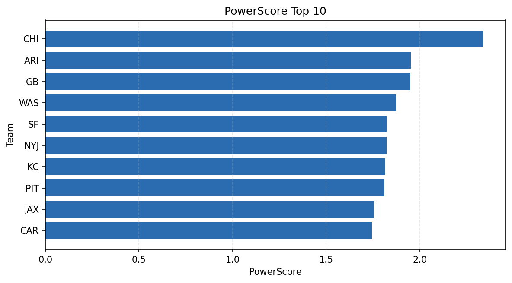

# Weekly Report - Season 2021, Week 8

_Generated at 2026-01-02T20:58:52.838046+00:00 (UTC)_

Data root: `data`

## Layer Shapes

| Layer | Artifact | Manifest | Rows | Columns | Status |
|-------|----------|----------|------|---------|--------|
| L1 Ingest | `data\l1\2021\8.parquet` | `data\l1\2021\8_manifest.json` | 2653 | 18 | ready |
| L2 Clean | `data\l2\2021\8.parquet` | `data\l2\2021\8_manifest.json` | 2653 | 24 | ready |
| L3 Team Week | `data\l3_team_week\2021\8.parquet` | `data\l3_team_week\2021\8_manifest.json` | 30 | 34 | ready |

## L2 Audit Snapshot

Last 3 entries from `data\l2_audit\2021\8_audit.jsonl`:

- {"step": "load", "details": "Loaded L1 parquet", "rows": 2653, "cols": 18, "timestamp": "2026-01-02T20:58:52.372373+00:00"}
- {"step": "prepare", "details": "Normalized team aliases, filtered season/week, deduplicated keys", "rows": 2653, "cols": 24, "rows_removed": 0, "timestamp": "2026-01-02T20:58:52.372373+00:00"}
- {"step": "validate", "details": "Validated against L2 contract and guardrails", "rows": 2653, "cols": 24, "timestamp": "2026-01-02T20:58:52.372373+00:00"}

## L3 Sanity

- Rows processed: 30
- Columns available: 34
- Artifact path: `data\l3_team_week\2021\8.parquet`

## Metrics Snapshot

### L4 Core12 Preview

- Artifact: `data\l4_core12\2021\8.parquet`
- Manifest: `data\l4_core12\2021\8_manifest.json`
- Rows: 30
- Columns: 27

| TEAM | core_epa_off | core_sr_off | core_sr_def |
| --- | --- | --- | --- |
| SF | 0.2851026654243469 | 0.4444444444444444 | 0.4418604651162791 |
| PHI | 0.2646280164960064 | 0.569620253164557 | 0.3333333333333333 |
| LA | 0.1757737338004342 | 0.5301204819277109 | 0.42857142857142855 |
| SEA | 0.13566239124400095 | 0.5352112676056338 | 0.3978494623655914 |
| GB | 0.12270618613097775 | 0.4606741573033708 | 0.5211267605633803 |

### PowerScore Rankings

- Artifact: `data\l4_powerscore\2021\8.parquet`
- Manifest: `data\l4_powerscore\2021\8_manifest.json`
- Rows: 30
- Columns: 4

| team | power_score |
| --- | --- |
| CHI | 2.341388869502686 |
| ARI | 1.9521875569110962 |
| GB | 1.950895492782574 |
| WAS | 1.873670170514501 |
| SF | 1.8245560269460595 |
| NYJ | 1.8226813751032342 |
| KC | 1.8170388945987364 |
| PIT | 1.8105757194700447 |
| JAX | 1.7568817588093972 |
| CAR | 1.7447610277810015 |

## Visualizations

