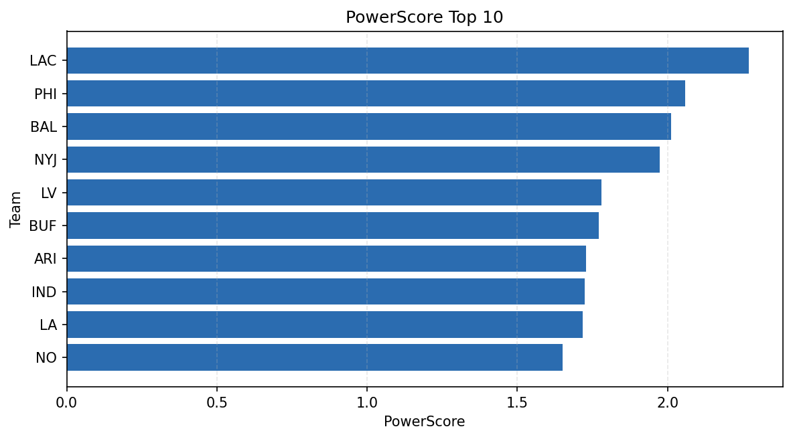

# Weekly Report - Season 2021, Week 9

_Generated at 2026-01-02T20:59:44.329867+00:00 (UTC)_

Data root: `data`

## Layer Shapes

| Layer | Artifact | Manifest | Rows | Columns | Status |
|-------|----------|----------|------|---------|--------|
| L1 Ingest | `data\l1\2021\9.parquet` | `data\l1\2021\9_manifest.json` | 2461 | 18 | ready |
| L2 Clean | `data\l2\2021\9.parquet` | `data\l2\2021\9_manifest.json` | 2461 | 24 | ready |
| L3 Team Week | `data\l3_team_week\2021\9.parquet` | `data\l3_team_week\2021\9_manifest.json` | 28 | 34 | ready |

## L2 Audit Snapshot

Last 3 entries from `data\l2_audit\2021\9_audit.jsonl`:

- {"step": "load", "details": "Loaded L1 parquet", "rows": 2461, "cols": 18, "timestamp": "2026-01-02T20:59:43.895103+00:00"}
- {"step": "prepare", "details": "Normalized team aliases, filtered season/week, deduplicated keys", "rows": 2461, "cols": 24, "rows_removed": 0, "timestamp": "2026-01-02T20:59:43.895103+00:00"}
- {"step": "validate", "details": "Validated against L2 contract and guardrails", "rows": 2461, "cols": 24, "timestamp": "2026-01-02T20:59:43.895103+00:00"}

## L3 Sanity

- Rows processed: 28
- Columns available: 34
- Artifact path: `data\l3_team_week\2021\9.parquet`

## Metrics Snapshot

### L4 Core12 Preview

- Artifact: `data\l4_core12\2021\9.parquet`
- Manifest: `data\l4_core12\2021\9_manifest.json`
- Rows: 28
- Columns: 27

| TEAM | core_epa_off | core_sr_off | core_sr_def |
| --- | --- | --- | --- |
| IND | 0.35023356981198245 | 0.5569620253164557 | 0.4479166666666667 |
| LAC | 0.23573647836154257 | 0.5185185185185185 | 0.5068493150684932 |
| MIN | 0.21240578107025526 | 0.410958904109589 | 0.5042735042735043 |
| ARI | 0.18138962144270365 | 0.45348837209302323 | 0.4666666666666667 |
| PHI | 0.16839932532955523 | 0.5068493150684932 | 0.5185185185185185 |

### PowerScore Rankings

- Artifact: `data\l4_powerscore\2021\9.parquet`
- Manifest: `data\l4_powerscore\2021\9_manifest.json`
- Rows: 28
- Columns: 4

| team | power_score |
| --- | --- |
| LAC | 2.2708172621220806 |
| PHI | 2.0577993883047765 |
| BAL | 2.011278282798777 |
| NYJ | 1.974641883802754 |
| LV | 1.78006640601602 |
| BUF | 1.7708000003297601 |
| ARI | 1.7297990429795846 |
| IND | 1.7251352965378846 |
| LA | 1.7181056028576238 |
| NO | 1.6510420428044672 |

## Visualizations

