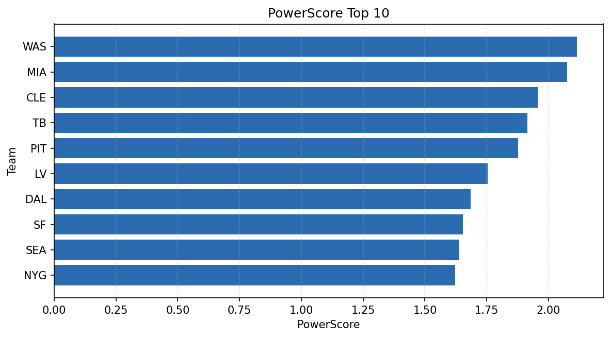

# Weekly Report - Season 2022, Week 10

_Generated at 2026-01-02T11:33:26.746900+00:00 (UTC)_

Data root: `data`

## Layer Shapes

| Layer | Artifact | Manifest | Rows | Columns | Status |
|-------|----------|----------|------|---------|--------|
| L1 Ingest | `data\l1\2022\10.parquet` | `data\l1\2022\10_manifest.json` | 2480 | 18 | ready |
| L2 Clean | `data\l2\2022\10.parquet` | `data\l2\2022\10_manifest.json` | 2480 | 24 | ready |
| L3 Team Week | `data\l3_team_week\2022\10.parquet` | `data\l3_team_week\2022\10_manifest.json` | 28 | 34 | ready |

## L2 Audit Snapshot

Last 3 entries from `data\l2_audit\2022\10_audit.jsonl`:

- {"step": "load", "details": "Loaded L1 parquet", "rows": 2480, "cols": 18, "timestamp": "2026-01-02T11:33:26.300792+00:00"}
- {"step": "prepare", "details": "Normalized team aliases, filtered season/week, deduplicated keys", "rows": 2480, "cols": 24, "rows_removed": 0, "timestamp": "2026-01-02T11:33:26.300792+00:00"}
- {"step": "validate", "details": "Validated against L2 contract and guardrails", "rows": 2480, "cols": 24, "timestamp": "2026-01-02T11:33:26.300792+00:00"}

## L3 Sanity

- Rows processed: 28
- Columns available: 34
- Artifact path: `data\l3_team_week\2022\10.parquet`

## Metrics Snapshot

### L4 Core12 Preview

- Artifact: `data\l4_core12\2022\10.parquet`
- Manifest: `data\l4_core12\2022\10_manifest.json`
- Rows: 28
- Columns: 27

| TEAM | core_epa_off | core_sr_off | core_sr_def |
| --- | --- | --- | --- |
| MIA | 0.2645039514930223 | 0.5662650602409639 | 0.4444444444444444 |
| GB | 0.10647513484021268 | 0.4578313253012048 | 0.47474747474747475 |
| DET | 0.09933385765776993 | 0.48717948717948717 | 0.4675324675324675 |
| WAS | 0.09858056155005188 | 0.494949494949495 | 0.4461538461538462 |
| KC | 0.09272716133544842 | 0.5066666666666667 | 0.43209876543209874 |

### PowerScore Rankings

- Artifact: `data\l4_powerscore\2022\10.parquet`
- Manifest: `data\l4_powerscore\2022\10_manifest.json`
- Rows: 28
- Columns: 4

| team | power_score |
| --- | --- |
| WAS | 2.1158971895163385 |
| MIA | 2.074611709305048 |
| CLE | 1.9570549807708741 |
| TB | 1.9148354977339679 |
| PIT | 1.877604886936263 |
| LV | 1.7532662658530165 |
| DAL | 1.6840092702436769 |
| SF | 1.6541525659335192 |
| SEA | 1.6381964824952637 |
| NYG | 1.6231792759551398 |

## Visualizations

