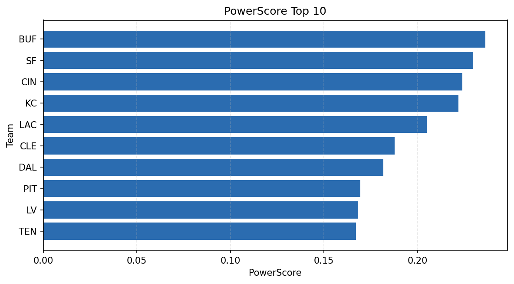

# Weekly Report - Season 2022, Week 11

_Generated at 2026-01-02T11:34:16.734310+00:00 (UTC)_

Data root: `data`

## Layer Shapes

| Layer | Artifact | Manifest | Rows | Columns | Status |
|-------|----------|----------|------|---------|--------|
| L1 Ingest | `data\l1\2022\11.parquet` | `data\l1\2022\11_manifest.json` | 2423 | 18 | ready |
| L2 Clean | `data\l2\2022\11.parquet` | `data\l2\2022\11_manifest.json` | 2423 | 24 | ready |
| L3 Team Week | `data\l3_team_week\2022\11.parquet` | `data\l3_team_week\2022\11_manifest.json` | 28 | 34 | ready |

## L2 Audit Snapshot

Last 3 entries from `data\l2_audit\2022\11_audit.jsonl`:

- {"step": "load", "details": "Loaded L1 parquet", "rows": 2423, "cols": 18, "timestamp": "2026-01-02T11:34:16.319659+00:00"}
- {"step": "prepare", "details": "Normalized team aliases, filtered season/week, deduplicated keys", "rows": 2423, "cols": 24, "rows_removed": 0, "timestamp": "2026-01-02T11:34:16.319659+00:00"}
- {"step": "validate", "details": "Validated against L2 contract and guardrails", "rows": 2423, "cols": 24, "timestamp": "2026-01-02T11:34:16.319659+00:00"}

## L3 Sanity

- Rows processed: 28
- Columns available: 34
- Artifact path: `data\l3_team_week\2022\11.parquet`

## Metrics Snapshot

### L4 Core12 Preview

- Artifact: `data\l4_core12\2022\11.parquet`
- Manifest: `data\l4_core12\2022\11_manifest.json`
- Rows: 28
- Columns: 27

| TEAM | core_epa_off | core_sr_off | core_sr_def |
| --- | --- | --- | --- |
| SF | 0.29407165501568766 | 0.5405405405405406 | 0.37209302325581395 |
| DAL | 0.2711811473730075 | 0.5058823529411764 | 0.225 |
| BUF | 0.1910811235099157 | 0.5555555555555556 | 0.47368421052631576 |
| CIN | 0.18548137111698879 | 0.5176470588235295 | 0.4387755102040816 |
| KC | 0.16745441082705995 | 0.47560975609756095 | 0.5185185185185185 |

### PowerScore Rankings

- Artifact: `data\l4_powerscore\2022\11.parquet`
- Manifest: `data\l4_powerscore\2022\11_manifest.json`
- Rows: 28
- Columns: 4

| team | power_score |
| --- | --- |
| CLE | 1.8898072959530858 |
| CHI | 1.8622532358199775 |
| DAL | 1.8605064864694278 |
| LAC | 1.8052970520545666 |
| LV | 1.7991612606491922 |
| NYG | 1.7487892635335203 |
| BUF | 1.6818644356142298 |
| KC | 1.6810928824426807 |
| ARI | 1.672754855193864 |
| DET | 1.6662389688449502 |

## Visualizations

