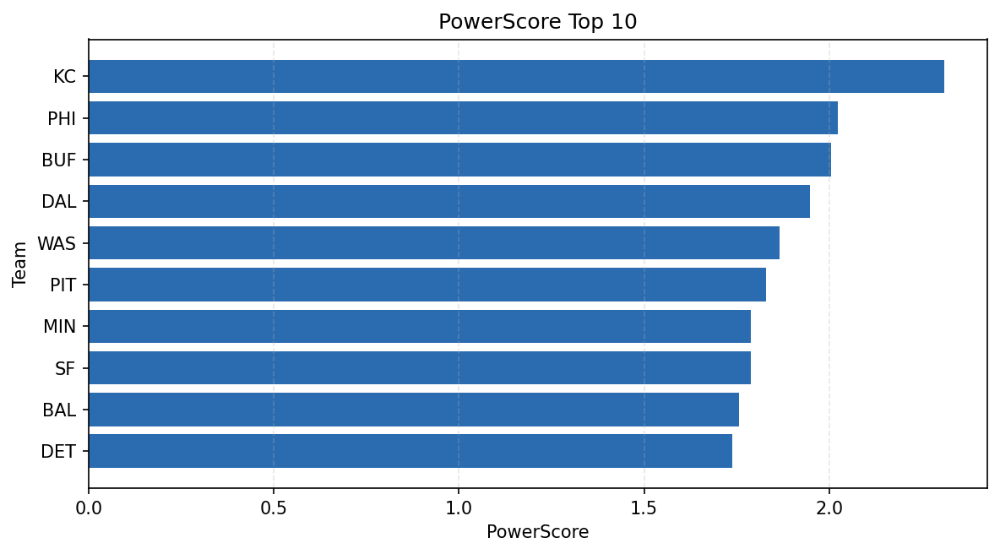

# Weekly Report - Season 2022, Week 12

_Generated at 2025-11-11T12:24:58.833563+00:00 (UTC)_

Data root: `data`

## Layer Shapes

| Layer | Artifact | Manifest | Rows | Columns | Status |
|-------|----------|----------|------|---------|--------|
| L1 Ingest | `data\l1\2022\12.parquet` | `data\l1\2022\12_manifest.json` | 2791 | 18 | ready |
| L2 Clean | `data\l2\2022\12.parquet` | `data\l2\2022\12_manifest.json` | 2791 | 24 | ready |
| L3 Team Week | `data\l3_team_week\2022\12.parquet` | `data\l3_team_week\2022\12_manifest.json` | 32 | 34 | ready |

## L2 Audit Snapshot

Last 3 entries from `data\l2_audit\2022\12_audit.jsonl`:

- {"step": "load", "details": "Loaded L1 parquet", "rows": 2791, "cols": 18, "timestamp": "2025-11-11T12:24:58.379377+00:00"}
- {"step": "prepare", "details": "Normalized team aliases, filtered season/week, deduplicated keys", "rows": 2791, "cols": 24, "rows_removed": 0, "timestamp": "2025-11-11T12:24:58.379377+00:00"}
- {"step": "validate", "details": "Validated against L2 contract and guardrails", "rows": 2791, "cols": 24, "timestamp": "2025-11-11T12:24:58.379377+00:00"}

## L3 Sanity

- Rows processed: 32
- Columns available: 34
- Artifact path: `data\l3_team_week\2022\12.parquet`

## Metrics Snapshot

### L4 Core12 Preview

- Artifact: `data\l4_core12\2022\12.parquet`
- Manifest: `data\l4_core12\2022\12_manifest.json`
- Rows: N/A
- Columns: N/A

| TEAM | core_epa_off | core_sr_off | core_sr_def |
| --- | --- | --- | --- |
| NYJ | 0.1907340570622565 | 0.5 | 0.3333333333333333 |
| GB | 0.16771963954141195 | 0.5 | 0.5252525252525253 |
| PHI | 0.16729860054799403 | 0.5252525252525253 | 0.5 |
| KC | 0.12761683001854393 | 0.5348837209302325 | 0.3194444444444444 |
| LV | 0.11787803180287687 | 0.47959183673469385 | 0.5176470588235295 |

### PowerScore Rankings

- Artifact: `data\l4_powerscore\2022\12.parquet`
- Manifest: `data\l4_powerscore\2022\12_manifest.json`
- Rows: 32
- Columns: 4

| team | power_score |
| --- | --- |
| PHI | 0.25371459971624194 |
| GB | 0.25049492728242634 |
| NYJ | 0.20245634133632062 |
| SEA | 0.1975497322624699 |
| LV | 0.19631935666438238 |
| BUF | 0.18896908991767544 |
| KC | 0.18461499370759993 |
| BAL | 0.17816953599120058 |
| DET | 0.173792363336051 |
| WAS | 0.17262348015216833 |

## Visualizations

