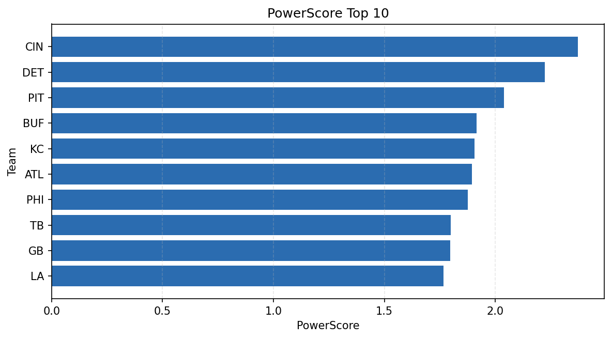

# Weekly Report - Season 2022, Week 13

_Generated at 2025-11-11T12:25:09.306897+00:00 (UTC)_

Data root: `data`

## Layer Shapes

| Layer | Artifact | Manifest | Rows | Columns | Status |
|-------|----------|----------|------|---------|--------|
| L1 Ingest | `data\l1\2022\13.parquet` | `data\l1\2022\13_manifest.json` | 2633 | 18 | ready |
| L2 Clean | `data\l2\2022\13.parquet` | `data\l2\2022\13_manifest.json` | 2633 | 24 | ready |
| L3 Team Week | `data\l3_team_week\2022\13.parquet` | `data\l3_team_week\2022\13_manifest.json` | 30 | 34 | ready |

## L2 Audit Snapshot

Last 3 entries from `data\l2_audit\2022\13_audit.jsonl`:

- {"step": "load", "details": "Loaded L1 parquet", "rows": 2633, "cols": 18, "timestamp": "2025-11-11T12:25:08.821258+00:00"}
- {"step": "prepare", "details": "Normalized team aliases, filtered season/week, deduplicated keys", "rows": 2633, "cols": 24, "rows_removed": 0, "timestamp": "2025-11-11T12:25:08.821258+00:00"}
- {"step": "validate", "details": "Validated against L2 contract and guardrails", "rows": 2633, "cols": 24, "timestamp": "2025-11-11T12:25:08.821258+00:00"}

## L3 Sanity

- Rows processed: 30
- Columns available: 34
- Artifact path: `data\l3_team_week\2022\13.parquet`

## Metrics Snapshot

### L4 Core12 Preview

- Artifact: `data\l4_core12\2022\13.parquet`
- Manifest: `data\l4_core12\2022\13_manifest.json`
- Rows: N/A
- Columns: N/A

| TEAM | core_epa_off | core_sr_off | core_sr_def |
| --- | --- | --- | --- |
| DET | 0.2436284928884521 | 0.5494505494505495 | 0.3424657534246575 |
| KC | 0.17789364923069725 | 0.5522388059701493 | 0.5232558139534884 |
| DAL | 0.16346647962927818 | 0.45348837209302323 | 0.36666666666666664 |
| CIN | 0.16027272355114652 | 0.5232558139534884 | 0.5522388059701493 |
| PHI | 0.15193768515018746 | 0.4583333333333333 | 0.2916666666666667 |

### PowerScore Rankings

- Artifact: `data\l4_powerscore\2022\13.parquet`
- Manifest: `data\l4_powerscore\2022\13_manifest.json`
- Rows: 30
- Columns: 4

| team | power_score |
| --- | --- |
| KC | 0.26819791895589873 |
| CIN | 0.24341836913555237 |
| DET | 0.21644887710154 |
| SEA | 0.19265306997736178 |
| GB | 0.17551225461613557 |
| LA | 0.1689952363969404 |
| PIT | 0.16479969720097903 |
| ATL | 0.161540592380275 |
| CHI | 0.157891170052815 |
| BUF | 0.15125846858892364 |

## Visualizations

