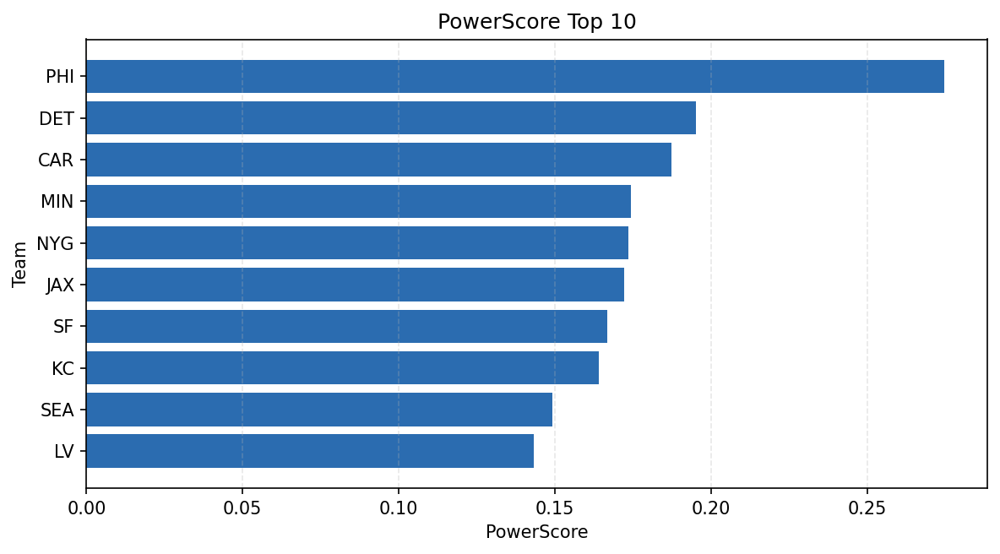

# Weekly Report - Season 2022, Week 14

_Generated at 2026-01-02T11:36:57.606137+00:00 (UTC)_

Data root: `data`

## Layer Shapes

| Layer | Artifact | Manifest | Rows | Columns | Status |
|-------|----------|----------|------|---------|--------|
| L1 Ingest | `data\l1\2022\14.parquet` | `data\l1\2022\14_manifest.json` | 2274 | 18 | ready |
| L2 Clean | `data\l2\2022\14.parquet` | `data\l2\2022\14_manifest.json` | 2274 | 24 | ready |
| L3 Team Week | `data\l3_team_week\2022\14.parquet` | `data\l3_team_week\2022\14_manifest.json` | 26 | 34 | ready |

## L2 Audit Snapshot

Last 3 entries from `data\l2_audit\2022\14_audit.jsonl`:

- {"step": "load", "details": "Loaded L1 parquet", "rows": 2274, "cols": 18, "timestamp": "2026-01-02T11:36:57.193456+00:00"}
- {"step": "prepare", "details": "Normalized team aliases, filtered season/week, deduplicated keys", "rows": 2274, "cols": 24, "rows_removed": 0, "timestamp": "2026-01-02T11:36:57.193456+00:00"}
- {"step": "validate", "details": "Validated against L2 contract and guardrails", "rows": 2274, "cols": 24, "timestamp": "2026-01-02T11:36:57.193456+00:00"}

## L3 Sanity

- Rows processed: 26
- Columns available: 34
- Artifact path: `data\l3_team_week\2022\14.parquet`

## Metrics Snapshot

### L4 Core12 Preview

- Artifact: `data\l4_core12\2022\14.parquet`
- Manifest: `data\l4_core12\2022\14_manifest.json`
- Rows: 26
- Columns: 27

| TEAM | core_epa_off | core_sr_off | core_sr_def |
| --- | --- | --- | --- |
| PHI | 0.3348179808434318 | 0.5411764705882353 | 0.43902439024390244 |
| DET | 0.15596478726630184 | 0.4431818181818182 | 0.4074074074074074 |
| JAX | 0.13906876374449995 | 0.4777777777777778 | 0.47560975609756095 |
| CAR | 0.12233923228232416 | 0.5054945054945055 | 0.4084507042253521 |
| SF | 0.11570523087030803 | 0.5384615384615384 | 0.3977272727272727 |

### PowerScore Rankings

- Artifact: `data\l4_powerscore\2022\14.parquet`
- Manifest: `data\l4_powerscore\2022\14_manifest.json`
- Rows: 26
- Columns: 4

| team | power_score |
| --- | --- |
| LAC | 1.8987835875603947 |
| CAR | 1.822187953972814 |
| DET | 1.7748399456466055 |
| LV | 1.7464323099870007 |
| LA | 1.7024671088943373 |
| PHI | 1.6562175848789153 |
| JAX | 1.6498833392419647 |
| NYG | 1.6450021723612331 |
| CLE | 1.6424528242982426 |
| PIT | 1.6423174333663246 |

## Visualizations

