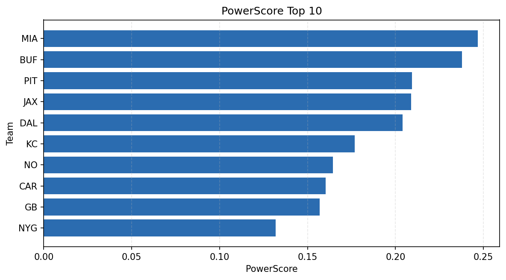

# Weekly Report - Season 2022, Week 15

_Generated at 2026-01-02T11:37:58.025072+00:00 (UTC)_

Data root: `data`

## Layer Shapes

| Layer | Artifact | Manifest | Rows | Columns | Status |
|-------|----------|----------|------|---------|--------|
| L1 Ingest | `data\l1\2022\15.parquet` | `data\l1\2022\15_manifest.json` | 2853 | 18 | ready |
| L2 Clean | `data\l2\2022\15.parquet` | `data\l2\2022\15_manifest.json` | 2853 | 24 | ready |
| L3 Team Week | `data\l3_team_week\2022\15.parquet` | `data\l3_team_week\2022\15_manifest.json` | 32 | 34 | ready |

## L2 Audit Snapshot

Last 3 entries from `data\l2_audit\2022\15_audit.jsonl`:

- {"step": "load", "details": "Loaded L1 parquet", "rows": 2853, "cols": 18, "timestamp": "2026-01-02T11:37:57.624790+00:00"}
- {"step": "prepare", "details": "Normalized team aliases, filtered season/week, deduplicated keys", "rows": 2853, "cols": 24, "rows_removed": 0, "timestamp": "2026-01-02T11:37:57.624790+00:00"}
- {"step": "validate", "details": "Validated against L2 contract and guardrails", "rows": 2853, "cols": 24, "timestamp": "2026-01-02T11:37:57.624790+00:00"}

## L3 Sanity

- Rows processed: 32
- Columns available: 34
- Artifact path: `data\l3_team_week\2022\15.parquet`

## Metrics Snapshot

### L4 Core12 Preview

- Artifact: `data\l4_core12\2022\15.parquet`
- Manifest: `data\l4_core12\2022\15_manifest.json`
- Rows: 32
- Columns: 27

| TEAM | core_epa_off | core_sr_off | core_sr_def |
| --- | --- | --- | --- |
| MIA | 0.20231600057382088 | 0.4805194805194805 | 0.5154639175257731 |
| PIT | 0.17083898543690643 | 0.5 | 0.3548387096774194 |
| BUF | 0.13708390938790188 | 0.5154639175257731 | 0.4805194805194805 |
| JAX | 0.10259568769898679 | 0.5222222222222223 | 0.5531914893617021 |
| DAL | 0.06814040009804229 | 0.5531914893617021 | 0.5222222222222223 |

### PowerScore Rankings

- Artifact: `data\l4_powerscore\2022\15.parquet`
- Manifest: `data\l4_powerscore\2022\15_manifest.json`
- Rows: 32
- Columns: 4

| team | power_score |
| --- | --- |
| PIT | 2.0618270731698822 |
| GB | 1.959669966563812 |
| ATL | 1.9158253835600512 |
| BUF | 1.83397521444864 |
| CLE | 1.7789249136540537 |
| MIA | 1.7583572522082878 |
| DAL | 1.7493328165812043 |
| DET | 1.7020901101343704 |
| KC | 1.7010116719057964 |
| CAR | 1.6910193073072581 |

## Visualizations

