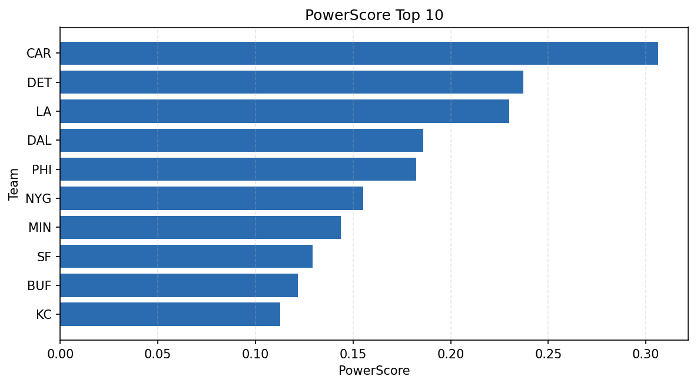

# Weekly Report - Season 2022, Week 16

_Generated at 2025-11-11T12:25:41.012378+00:00 (UTC)_

Data root: `data`

## Layer Shapes

| Layer | Artifact | Manifest | Rows | Columns | Status |
|-------|----------|----------|------|---------|--------|
| L1 Ingest | `data\l1\2022\16.parquet` | `data\l1\2022\16_manifest.json` | 2744 | 18 | ready |
| L2 Clean | `data\l2\2022\16.parquet` | `data\l2\2022\16_manifest.json` | 2744 | 24 | ready |
| L3 Team Week | `data\l3_team_week\2022\16.parquet` | `data\l3_team_week\2022\16_manifest.json` | 32 | 34 | ready |

## L2 Audit Snapshot

Last 3 entries from `data\l2_audit\2022\16_audit.jsonl`:

- {"step": "load", "details": "Loaded L1 parquet", "rows": 2744, "cols": 18, "timestamp": "2025-11-11T12:25:40.546812+00:00"}
- {"step": "prepare", "details": "Normalized team aliases, filtered season/week, deduplicated keys", "rows": 2744, "cols": 24, "rows_removed": 0, "timestamp": "2025-11-11T12:25:40.546812+00:00"}
- {"step": "validate", "details": "Validated against L2 contract and guardrails", "rows": 2744, "cols": 24, "timestamp": "2025-11-11T12:25:40.546812+00:00"}

## L3 Sanity

- Rows processed: 32
- Columns available: 34
- Artifact path: `data\l3_team_week\2022\16.parquet`

## Metrics Snapshot

### L4 Core12 Preview

- Artifact: `data\l4_core12\2022\16.parquet`
- Manifest: `data\l4_core12\2022\16_manifest.json`
- Rows: N/A
- Columns: N/A

| TEAM | core_epa_off | core_sr_off | core_sr_def |
| --- | --- | --- | --- |
| LA | 0.30993039980133225 | 0.573170731707317 | 0.35802469135802467 |
| CAR | 0.29833244461189495 | 0.550561797752809 | 0.43209876543209874 |
| DET | 0.1420275642203144 | 0.43209876543209874 | 0.550561797752809 |
| SF | 0.11676230659598813 | 0.39705882352941174 | 0.3516483516483517 |
| DAL | 0.10864152722470052 | 0.4725274725274725 | 0.47191011235955055 |

### PowerScore Rankings

- Artifact: `data\l4_powerscore\2022\16.parquet`
- Manifest: `data\l4_powerscore\2022\16_manifest.json`
- Rows: 32
- Columns: 4

| team | power_score |
| --- | --- |
| CAR | 0.3064173740762037 |
| DET | 0.2371539141772668 |
| LA | 0.23001155723287872 |
| DAL | 0.18587918182084542 |
| PHI | 0.1824726417499379 |
| NYG | 0.15509863166490762 |
| MIN | 0.14373101218467732 |
| SF | 0.12912399249097767 |
| BUF | 0.12184091569357894 |
| KC | 0.11267595196020529 |

## Visualizations

