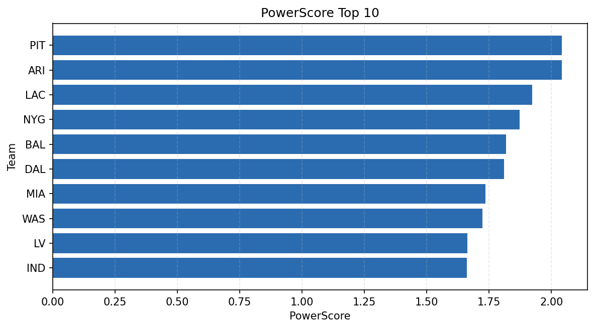

# Weekly Report - Season 2022, Week 17

_Generated at 2025-11-11T12:25:51.252010+00:00 (UTC)_

Data root: `data`

## Layer Shapes

| Layer | Artifact | Manifest | Rows | Columns | Status |
|-------|----------|----------|------|---------|--------|
| L1 Ingest | `data\l1\2022\17.parquet` | `data\l1\2022\17_manifest.json` | 2566 | 18 | ready |
| L2 Clean | `data\l2\2022\17.parquet` | `data\l2\2022\17_manifest.json` | 2566 | 24 | ready |
| L3 Team Week | `data\l3_team_week\2022\17.parquet` | `data\l3_team_week\2022\17_manifest.json` | 30 | 34 | ready |

## L2 Audit Snapshot

Last 3 entries from `data\l2_audit\2022\17_audit.jsonl`:

- {"step": "load", "details": "Loaded L1 parquet", "rows": 2566, "cols": 18, "timestamp": "2025-11-11T12:25:50.672449+00:00"}
- {"step": "prepare", "details": "Normalized team aliases, filtered season/week, deduplicated keys", "rows": 2566, "cols": 24, "rows_removed": 0, "timestamp": "2025-11-11T12:25:50.672449+00:00"}
- {"step": "validate", "details": "Validated against L2 contract and guardrails", "rows": 2566, "cols": 24, "timestamp": "2025-11-11T12:25:50.672449+00:00"}

## L3 Sanity

- Rows processed: 30
- Columns available: 34
- Artifact path: `data\l3_team_week\2022\17.parquet`

## Metrics Snapshot

### L4 Core12 Preview

- Artifact: `data\l4_core12\2022\17.parquet`
- Manifest: `data\l4_core12\2022\17_manifest.json`
- Rows: N/A
- Columns: N/A

| TEAM | core_epa_off | core_sr_off | core_sr_def |
| --- | --- | --- | --- |
| DET | 0.19683958729729056 | 0.5 | 0.34285714285714286 |
| NYG | 0.19650192485239945 | 0.6052631578947368 | 0.3472222222222222 |
| LAC | 0.18139432800367852 | 0.5189873417721519 | 0.35384615384615387 |
| SF | 0.1615575671325936 | 0.5348837209302325 | 0.4943820224719101 |
| CLE | 0.11013643897098044 | 0.42028985507246375 | 0.3493975903614458 |

### PowerScore Rankings

- Artifact: `data\l4_powerscore\2022\17.parquet`
- Manifest: `data\l4_powerscore\2022\17_manifest.json`
- Rows: 30
- Columns: 4

| team | power_score |
| --- | --- |
| SF | 0.23164286786642413 |
| NYG | 0.21401414622808668 |
| LV | 0.2041982918563181 |
| PIT | 0.19237513729839772 |
| LAC | 0.19020781652749352 |
| DET | 0.17425452743336414 |
| BAL | 0.16703126100610144 |
| KC | 0.1514425852828935 |
| TB | 0.15034956609276737 |
| CAR | 0.14110504844907468 |

## Visualizations

