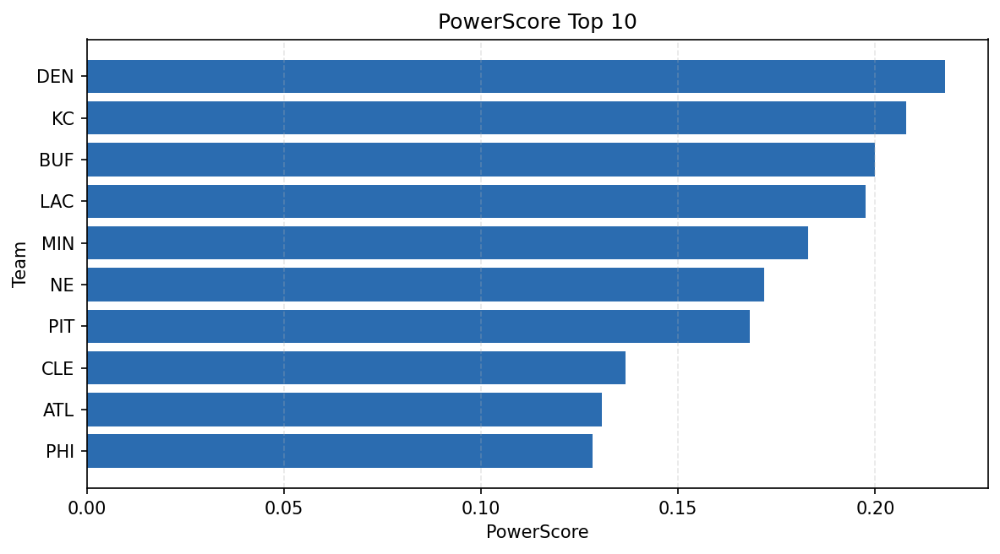

# Weekly Report - Season 2022, Week 18

_Generated at 2025-11-11T12:26:03.097283+00:00 (UTC)_

Data root: `data`

## Layer Shapes

| Layer | Artifact | Manifest | Rows | Columns | Status |
|-------|----------|----------|------|---------|--------|
| L1 Ingest | `data\l1\2022\18.parquet` | `data\l1\2022\18_manifest.json` | 2720 | 18 | ready |
| L2 Clean | `data\l2\2022\18.parquet` | `data\l2\2022\18_manifest.json` | 2720 | 24 | ready |
| L3 Team Week | `data\l3_team_week\2022\18.parquet` | `data\l3_team_week\2022\18_manifest.json` | 32 | 34 | ready |

## L2 Audit Snapshot

Last 3 entries from `data\l2_audit\2022\18_audit.jsonl`:

- {"step": "load", "details": "Loaded L1 parquet", "rows": 2720, "cols": 18, "timestamp": "2025-11-11T12:26:02.435152+00:00"}
- {"step": "prepare", "details": "Normalized team aliases, filtered season/week, deduplicated keys", "rows": 2720, "cols": 24, "rows_removed": 0, "timestamp": "2025-11-11T12:26:02.435152+00:00"}
- {"step": "validate", "details": "Validated against L2 contract and guardrails", "rows": 2720, "cols": 24, "timestamp": "2025-11-11T12:26:02.435152+00:00"}

## L3 Sanity

- Rows processed: 32
- Columns available: 34
- Artifact path: `data\l3_team_week\2022\18.parquet`

## Metrics Snapshot

### L4 Core12 Preview

- Artifact: `data\l4_core12\2022\18.parquet`
- Manifest: `data\l4_core12\2022\18_manifest.json`
- Rows: N/A
- Columns: N/A

| TEAM | core_epa_off | core_sr_off | core_sr_def |
| --- | --- | --- | --- |
| KC | 0.18602100417017936 | 0.5466666666666666 | 0.4024390243902439 |
| MIN | 0.15902301556106363 | 0.5056179775280899 | 0.30303030303030304 |
| BUF | 0.15823373980379687 | 0.4864864864864865 | 0.4634146341463415 |
| DEN | 0.1317367262868996 | 0.4457831325301205 | 0.4418604651162791 |
| PIT | 0.13000982755058726 | 0.4418604651162791 | 0.38961038961038963 |

### PowerScore Rankings

- Artifact: `data\l4_powerscore\2022\18.parquet`
- Manifest: `data\l4_powerscore\2022\18_manifest.json`
- Rows: 32
- Columns: 4

| team | power_score |
| --- | --- |
| DEN | 0.21772671742711824 |
| KC | 0.2079531793101289 |
| BUF | 0.2000297429931607 |
| LAC | 0.1974669908158508 |
| MIN | 0.18305804793652214 |
| NE | 0.17190983494206982 |
| PIT | 0.16814854757694206 |
| CLE | 0.13666306990394106 |
| ATL | 0.1305912737056946 |
| PHI | 0.12826106771991647 |

## Visualizations

