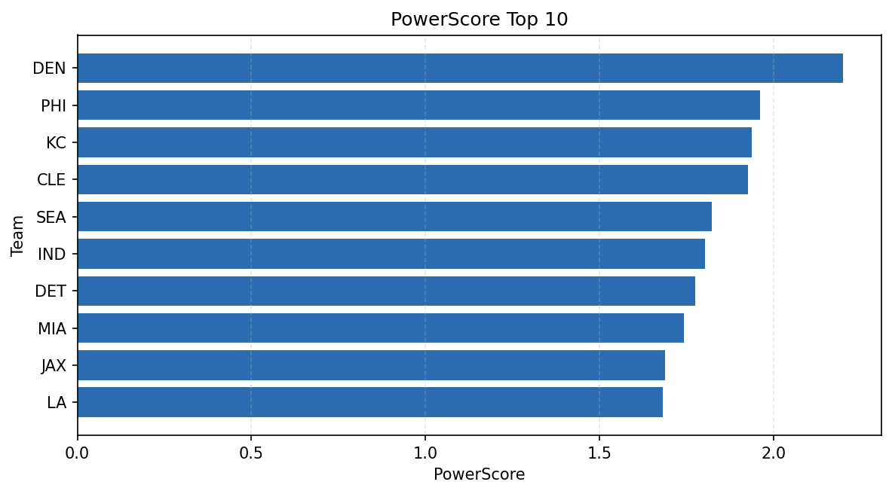

# Weekly Report - Season 2022, Week 1

_Generated at 2025-11-11T12:23:04.542752+00:00 (UTC)_

Data root: `data`

## Layer Shapes

| Layer | Artifact | Manifest | Rows | Columns | Status |
|-------|----------|----------|------|---------|--------|
| L1 Ingest | `data\l1\2022\1.parquet` | `data\l1\2022\1_manifest.json` | 2848 | 18 | ready |
| L2 Clean | `data\l2\2022\1.parquet` | `data\l2\2022\1_manifest.json` | 2848 | 24 | ready |
| L3 Team Week | `data\l3_team_week\2022\1.parquet` | `data\l3_team_week\2022\1_manifest.json` | 32 | 34 | ready |

## L2 Audit Snapshot

Last 3 entries from `data\l2_audit\2022\1_audit.jsonl`:

- {"step": "load", "details": "Loaded L1 parquet", "rows": 2848, "cols": 18, "timestamp": "2025-11-11T12:23:03.868069+00:00"}
- {"step": "prepare", "details": "Normalized team aliases, filtered season/week, deduplicated keys", "rows": 2848, "cols": 24, "rows_removed": 0, "timestamp": "2025-11-11T12:23:03.868069+00:00"}
- {"step": "validate", "details": "Validated against L2 contract and guardrails", "rows": 2848, "cols": 24, "timestamp": "2025-11-11T12:23:03.868069+00:00"}

## L3 Sanity

- Rows processed: 32
- Columns available: 34
- Artifact path: `data\l3_team_week\2022\1.parquet`

## Metrics Snapshot

### L4 Core12 Preview

- Artifact: `data\l4_core12\2022\1.parquet`
- Manifest: `data\l4_core12\2022\1_manifest.json`
- Rows: N/A
- Columns: N/A

| TEAM | core_epa_off | core_sr_off | core_sr_def |
| --- | --- | --- | --- |
| KC | 0.36571086300200367 | 0.5903614457831325 | 0.37349397590361444 |
| BUF | 0.13554744848183223 | 0.5142857142857142 | 0.3902439024390244 |
| PHI | 0.13101207841263743 | 0.46938775510204084 | 0.4044943820224719 |
| DET | 0.08304395592572648 | 0.4044943820224719 | 0.46938775510204084 |
| MIN | 0.08175316386115856 | 0.41025641025641024 | 0.41333333333333333 |

### PowerScore Rankings

- Artifact: `data\l4_powerscore\2022\1.parquet`
- Manifest: `data\l4_powerscore\2022\1_manifest.json`
- Rows: 32
- Columns: 4

| team | power_score |
| --- | --- |
| KC | 0.3140454267729523 |
| PHI | 0.20634056964997657 |
| ARI | 0.18742858514144836 |
| DET | 0.18111049688574524 |
| DEN | 0.17702402604556014 |
| SEA | 0.1750721466095259 |
| JAX | 0.16866181526429702 |
| CLE | 0.16568292613614863 |
| NO | 0.15891944213486767 |
| NYG | 0.1514668817316478 |

## Visualizations

