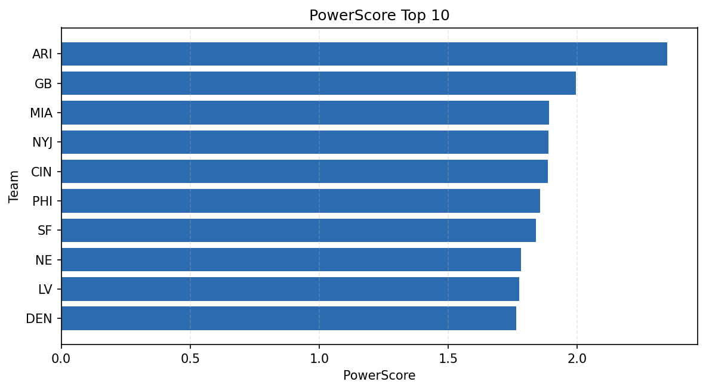

# Weekly Report - Season 2022, Week 2

_Generated at 2026-01-02T11:28:00.891724+00:00 (UTC)_

Data root: `data`

## Layer Shapes

| Layer | Artifact | Manifest | Rows | Columns | Status |
|-------|----------|----------|------|---------|--------|
| L1 Ingest | `data\l1\2022\2.parquet` | `data\l1\2022\2_manifest.json` | 2747 | 18 | ready |
| L2 Clean | `data\l2\2022\2.parquet` | `data\l2\2022\2_manifest.json` | 2747 | 24 | ready |
| L3 Team Week | `data\l3_team_week\2022\2.parquet` | `data\l3_team_week\2022\2_manifest.json` | 32 | 34 | ready |

## L2 Audit Snapshot

Last 3 entries from `data\l2_audit\2022\2_audit.jsonl`:

- {"step": "load", "details": "Loaded L1 parquet", "rows": 2747, "cols": 18, "timestamp": "2026-01-02T11:28:00.523051+00:00"}
- {"step": "prepare", "details": "Normalized team aliases, filtered season/week, deduplicated keys", "rows": 2747, "cols": 24, "rows_removed": 0, "timestamp": "2026-01-02T11:28:00.523051+00:00"}
- {"step": "validate", "details": "Validated against L2 contract and guardrails", "rows": 2747, "cols": 24, "timestamp": "2026-01-02T11:28:00.523051+00:00"}

## L3 Sanity

- Rows processed: 32
- Columns available: 34
- Artifact path: `data\l3_team_week\2022\2.parquet`

## Metrics Snapshot

### L4 Core12 Preview

- Artifact: `data\l4_core12\2022\2.parquet`
- Manifest: `data\l4_core12\2022\2_manifest.json`
- Rows: 32
- Columns: 27

| TEAM | core_epa_off | core_sr_off | core_sr_def |
| --- | --- | --- | --- |
| MIA | 0.3416804207098167 | 0.5172413793103449 | 0.4675324675324675 |
| BAL | 0.29255757050274256 | 0.4675324675324675 | 0.5172413793103449 |
| BUF | 0.19703126337032678 | 0.4883720930232558 | 0.37333333333333335 |
| CLE | 0.19434427023615417 | 0.4878048780487805 | 0.44565217391304346 |
| NYJ | 0.1832670474667912 | 0.44565217391304346 | 0.4878048780487805 |

### PowerScore Rankings

- Artifact: `data\l4_powerscore\2022\2.parquet`
- Manifest: `data\l4_powerscore\2022\2_manifest.json`
- Rows: 32
- Columns: 4

| team | power_score |
| --- | --- |
| ARI | 2.3482748783285508 |
| GB | 1.9935630413688592 |
| MIA | 1.8892281879947526 |
| NYJ | 1.8871526368661415 |
| CIN | 1.886050090799548 |
| PHI | 1.8557518685982488 |
| SF | 1.8383671554318892 |
| NE | 1.7813287103128004 |
| LV | 1.7740069396394722 |
| DEN | 1.7627317347544245 |

## Visualizations

