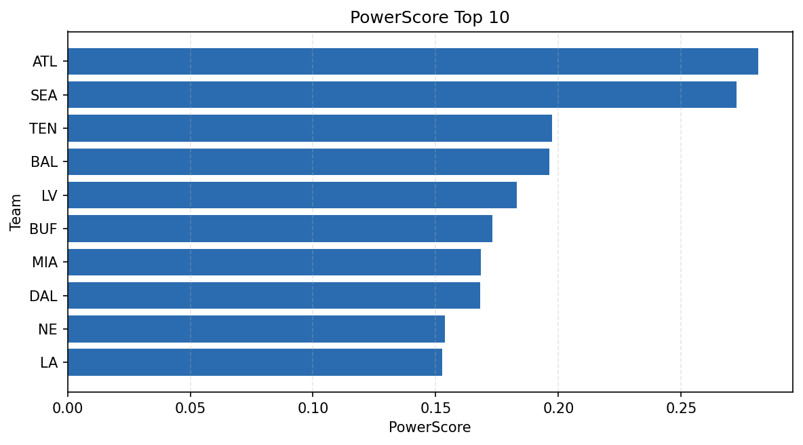

# Weekly Report - Season 2022, Week 3

_Generated at 2026-01-02T11:28:34.562233+00:00 (UTC)_

Data root: `data`

## Layer Shapes

| Layer | Artifact | Manifest | Rows | Columns | Status |
|-------|----------|----------|------|---------|--------|
| L1 Ingest | `data\l1\2022\3.parquet` | `data\l1\2022\3_manifest.json` | 2807 | 18 | ready |
| L2 Clean | `data\l2\2022\3.parquet` | `data\l2\2022\3_manifest.json` | 2807 | 24 | ready |
| L3 Team Week | `data\l3_team_week\2022\3.parquet` | `data\l3_team_week\2022\3_manifest.json` | 32 | 34 | ready |

## L2 Audit Snapshot

Last 3 entries from `data\l2_audit\2022\3_audit.jsonl`:

- {"step": "load", "details": "Loaded L1 parquet", "rows": 2807, "cols": 18, "timestamp": "2026-01-02T11:28:34.161464+00:00"}
- {"step": "prepare", "details": "Normalized team aliases, filtered season/week, deduplicated keys", "rows": 2807, "cols": 24, "rows_removed": 0, "timestamp": "2026-01-02T11:28:34.161464+00:00"}
- {"step": "validate", "details": "Validated against L2 contract and guardrails", "rows": 2807, "cols": 24, "timestamp": "2026-01-02T11:28:34.161464+00:00"}

## L3 Sanity

- Rows processed: 32
- Columns available: 34
- Artifact path: `data\l3_team_week\2022\3.parquet`

## Metrics Snapshot

### L4 Core12 Preview

- Artifact: `data\l4_core12\2022\3.parquet`
- Manifest: `data\l4_core12\2022\3_manifest.json`
- Rows: 32
- Columns: 27

| TEAM | core_epa_off | core_sr_off | core_sr_def |
| --- | --- | --- | --- |
| ATL | 0.2802561280698004 | 0.49295774647887325 | 0.5517241379310345 |
| JAX | 0.17698726627034145 | 0.4945054945054945 | 0.33766233766233766 |
| BAL | 0.17040754864355187 | 0.45454545454545453 | 0.4074074074074074 |
| SEA | 0.1455592561470366 | 0.5517241379310345 | 0.49295774647887325 |
| MIA | 0.09751746520123561 | 0.44642857142857145 | 0.4811320754716981 |

### PowerScore Rankings

- Artifact: `data\l4_powerscore\2022\3.parquet`
- Manifest: `data\l4_powerscore\2022\3_manifest.json`
- Rows: 32
- Columns: 4

| team | power_score |
| --- | --- |
| BUF | 2.509912744006124 |
| SEA | 2.419927999748182 |
| ARI | 2.279290831196741 |
| LV | 2.046069759322874 |
| NYG | 1.9184291671836124 |
| ATL | 1.8282187104513337 |
| JAX | 1.786240985944726 |
| CLE | 1.7165921086719103 |
| DAL | 1.6506346170965924 |
| KC | 1.6478670342219226 |

## Visualizations

