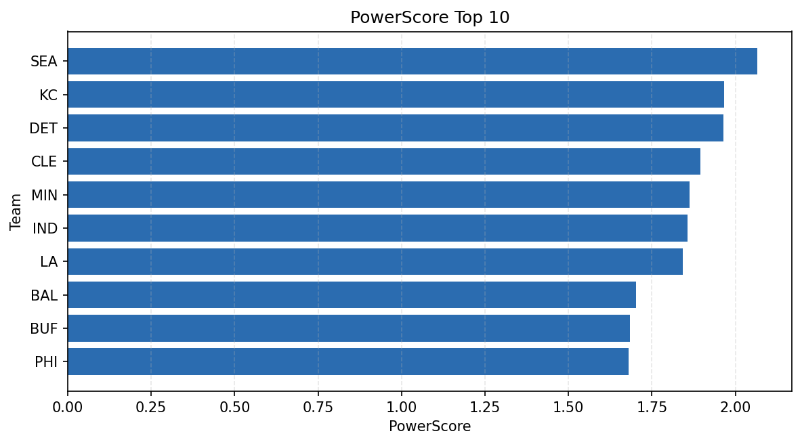

# Weekly Report - Season 2022, Week 4

_Generated at 2026-01-02T11:29:10.873452+00:00 (UTC)_

Data root: `data`

## Layer Shapes

| Layer | Artifact | Manifest | Rows | Columns | Status |
|-------|----------|----------|------|---------|--------|
| L1 Ingest | `data\l1\2022\4.parquet` | `data\l1\2022\4_manifest.json` | 2795 | 18 | ready |
| L2 Clean | `data\l2\2022\4.parquet` | `data\l2\2022\4_manifest.json` | 2795 | 24 | ready |
| L3 Team Week | `data\l3_team_week\2022\4.parquet` | `data\l3_team_week\2022\4_manifest.json` | 32 | 34 | ready |

## L2 Audit Snapshot

Last 3 entries from `data\l2_audit\2022\4_audit.jsonl`:

- {"step": "load", "details": "Loaded L1 parquet", "rows": 2795, "cols": 18, "timestamp": "2026-01-02T11:29:10.439473+00:00"}
- {"step": "prepare", "details": "Normalized team aliases, filtered season/week, deduplicated keys", "rows": 2795, "cols": 24, "rows_removed": 0, "timestamp": "2026-01-02T11:29:10.439473+00:00"}
- {"step": "validate", "details": "Validated against L2 contract and guardrails", "rows": 2795, "cols": 24, "timestamp": "2026-01-02T11:29:10.439473+00:00"}

## L3 Sanity

- Rows processed: 32
- Columns available: 34
- Artifact path: `data\l3_team_week\2022\4.parquet`

## Metrics Snapshot

### L4 Core12 Preview

- Artifact: `data\l4_core12\2022\4.parquet`
- Manifest: `data\l4_core12\2022\4_manifest.json`
- Rows: 32
- Columns: 27

| TEAM | core_epa_off | core_sr_off | core_sr_def |
| --- | --- | --- | --- |
| SEA | 0.32643917290849633 | 0.5280898876404494 | 0.4105263157894737 |
| KC | 0.21321291443503773 | 0.5520833333333334 | 0.5185185185185185 |
| DET | 0.19829574324386684 | 0.4105263157894737 | 0.5280898876404494 |
| MIN | 0.1428381017125819 | 0.4673913043478261 | 0.5189873417721519 |
| NO | 0.12118878059937985 | 0.5189873417721519 | 0.4673913043478261 |

### PowerScore Rankings

- Artifact: `data\l4_powerscore\2022\4.parquet`
- Manifest: `data\l4_powerscore\2022\4_manifest.json`
- Rows: 32
- Columns: 4

| team | power_score |
| --- | --- |
| SEA | 2.06593533107686 |
| KC | 1.9658424578301377 |
| DET | 1.9645956509371487 |
| CLE | 1.8960245754095588 |
| MIN | 1.863806190533509 |
| IND | 1.8562492626449978 |
| LA | 1.8430732587480316 |
| BAL | 1.7018436856489165 |
| BUF | 1.6836451234747731 |
| PHI | 1.6795059688811722 |

## Visualizations

