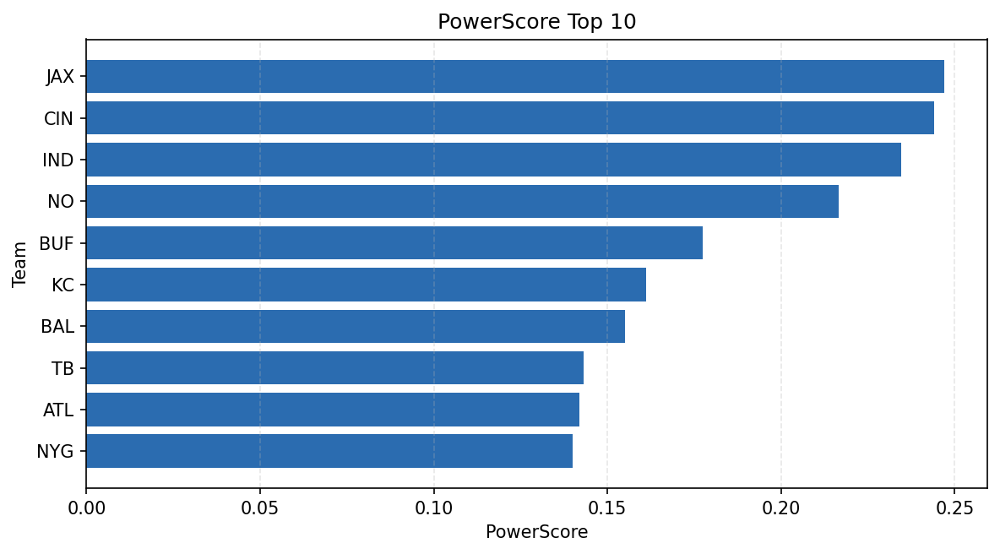

# Weekly Report - Season 2022, Week 6

_Generated at 2026-01-02T11:30:30.046209+00:00 (UTC)_

Data root: `data`

## Layer Shapes

| Layer | Artifact | Manifest | Rows | Columns | Status |
|-------|----------|----------|------|---------|--------|
| L1 Ingest | `data\l1\2022\6.parquet` | `data\l1\2022\6_manifest.json` | 2459 | 18 | ready |
| L2 Clean | `data\l2\2022\6.parquet` | `data\l2\2022\6_manifest.json` | 2459 | 24 | ready |
| L3 Team Week | `data\l3_team_week\2022\6.parquet` | `data\l3_team_week\2022\6_manifest.json` | 28 | 34 | ready |

## L2 Audit Snapshot

Last 3 entries from `data\l2_audit\2022\6_audit.jsonl`:

- {"step": "load", "details": "Loaded L1 parquet", "rows": 2459, "cols": 18, "timestamp": "2026-01-02T11:30:29.610268+00:00"}
- {"step": "prepare", "details": "Normalized team aliases, filtered season/week, deduplicated keys", "rows": 2459, "cols": 24, "rows_removed": 0, "timestamp": "2026-01-02T11:30:29.610268+00:00"}
- {"step": "validate", "details": "Validated against L2 contract and guardrails", "rows": 2459, "cols": 24, "timestamp": "2026-01-02T11:30:29.610268+00:00"}

## L3 Sanity

- Rows processed: 28
- Columns available: 34
- Artifact path: `data\l3_team_week\2022\6.parquet`

## Metrics Snapshot

### L4 Core12 Preview

- Artifact: `data\l4_core12\2022\6.parquet`
- Manifest: `data\l4_core12\2022\6_manifest.json`
- Rows: 28
- Columns: 27

| TEAM | core_epa_off | core_sr_off | core_sr_def |
| --- | --- | --- | --- |
| CIN | 0.21147869432914174 | 0.5277777777777778 | 0.45054945054945056 |
| IND | 0.17785618465859443 | 0.4583333333333333 | 0.5064935064935064 |
| JAX | 0.15357386955822055 | 0.5064935064935064 | 0.4583333333333333 |
| NE | 0.13191039788146172 | 0.3870967741935484 | 0.3218390804597701 |
| NO | 0.10697129303282434 | 0.45054945054945056 | 0.5277777777777778 |

### PowerScore Rankings

- Artifact: `data\l4_powerscore\2022\6.parquet`
- Manifest: `data\l4_powerscore\2022\6_manifest.json`
- Rows: 28
- Columns: 4

| team | power_score |
| --- | --- |
| IND | 2.1275477718754856 |
| NO | 2.0123730540646796 |
| TB | 1.9902250379821043 |
| BUF | 1.8921251029179742 |
| BAL | 1.8044799381176864 |
| LAC | 1.7897525663618439 |
| KC | 1.776648298438745 |
| NYG | 1.7679102698780103 |
| JAX | 1.7559454679004727 |
| ATL | 1.7253420610050672 |

## Visualizations

