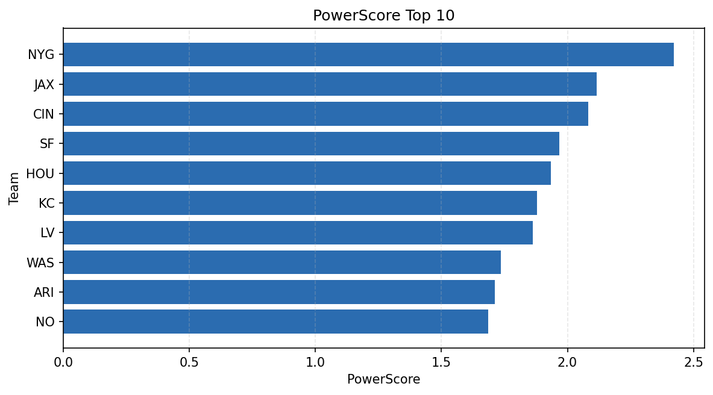

# Weekly Report - Season 2022, Week 7

_Generated at 2025-11-11T12:24:08.184674+00:00 (UTC)_

Data root: `data`

## Layer Shapes

| Layer | Artifact | Manifest | Rows | Columns | Status |
|-------|----------|----------|------|---------|--------|
| L1 Ingest | `data\l1\2022\7.parquet` | `data\l1\2022\7_manifest.json` | 2390 | 18 | ready |
| L2 Clean | `data\l2\2022\7.parquet` | `data\l2\2022\7_manifest.json` | 2390 | 24 | ready |
| L3 Team Week | `data\l3_team_week\2022\7.parquet` | `data\l3_team_week\2022\7_manifest.json` | 28 | 34 | ready |

## L2 Audit Snapshot

Last 3 entries from `data\l2_audit\2022\7_audit.jsonl`:

- {"step": "load", "details": "Loaded L1 parquet", "rows": 2390, "cols": 18, "timestamp": "2025-11-11T12:24:07.720808+00:00"}
- {"step": "prepare", "details": "Normalized team aliases, filtered season/week, deduplicated keys", "rows": 2390, "cols": 24, "rows_removed": 0, "timestamp": "2025-11-11T12:24:07.720808+00:00"}
- {"step": "validate", "details": "Validated against L2 contract and guardrails", "rows": 2390, "cols": 24, "timestamp": "2025-11-11T12:24:07.720808+00:00"}

## L3 Sanity

- Rows processed: 28
- Columns available: 34
- Artifact path: `data\l3_team_week\2022\7.parquet`

## Metrics Snapshot

### L4 Core12 Preview

- Artifact: `data\l4_core12\2022\7.parquet`
- Manifest: `data\l4_core12\2022\7_manifest.json`
- Rows: N/A
- Columns: N/A

| TEAM | core_epa_off | core_sr_off | core_sr_def |
| --- | --- | --- | --- |
| KC | 0.37206446240306834 | 0.55 | 0.44329896907216493 |
| CIN | 0.23769714580183582 | 0.5357142857142857 | 0.3870967741935484 |
| LV | 0.23703312496277126 | 0.5405405405405406 | 0.4375 |
| NYG | 0.15709496142991472 | 0.5168539325842697 | 0.42045454545454547 |
| SEA | 0.11816163225209012 | 0.4823529411764706 | 0.37362637362637363 |

### PowerScore Rankings

- Artifact: `data\l4_powerscore\2022\7.parquet`
- Manifest: `data\l4_powerscore\2022\7_manifest.json`
- Rows: 28
- Columns: 4

| team | power_score |
| --- | --- |
| KC | 0.31543011091656437 |
| LV | 0.2604558844917857 |
| CIN | 0.2444387870859505 |
| SF | 0.23609053635241262 |
| NYG | 0.22423495773446725 |
| JAX | 0.18440853406754118 |
| HOU | 0.1802344716513196 |
| NO | 0.17862678092091722 |
| ARI | 0.1769178500508935 |
| ATL | 0.1550202241119948 |

## Visualizations

