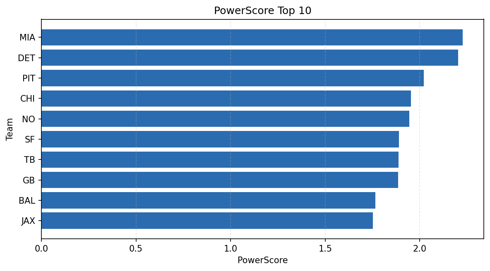

# Weekly Report - Season 2022, Week 8

_Generated at 2025-11-11T12:24:18.433632+00:00 (UTC)_

Data root: `data`

## Layer Shapes

| Layer | Artifact | Manifest | Rows | Columns | Status |
|-------|----------|----------|------|---------|--------|
| L1 Ingest | `data\l1\2022\8.parquet` | `data\l1\2022\8_manifest.json` | 2587 | 18 | ready |
| L2 Clean | `data\l2\2022\8.parquet` | `data\l2\2022\8_manifest.json` | 2587 | 24 | ready |
| L3 Team Week | `data\l3_team_week\2022\8.parquet` | `data\l3_team_week\2022\8_manifest.json` | 30 | 34 | ready |

## L2 Audit Snapshot

Last 3 entries from `data\l2_audit\2022\8_audit.jsonl`:

- {"step": "load", "details": "Loaded L1 parquet", "rows": 2587, "cols": 18, "timestamp": "2025-11-11T12:24:17.829112+00:00"}
- {"step": "prepare", "details": "Normalized team aliases, filtered season/week, deduplicated keys", "rows": 2587, "cols": 24, "rows_removed": 0, "timestamp": "2025-11-11T12:24:17.829112+00:00"}
- {"step": "validate", "details": "Validated against L2 contract and guardrails", "rows": 2587, "cols": 24, "timestamp": "2025-11-11T12:24:17.829112+00:00"}

## L3 Sanity

- Rows processed: 30
- Columns available: 34
- Artifact path: `data\l3_team_week\2022\8.parquet`

## Metrics Snapshot

### L4 Core12 Preview

- Artifact: `data\l4_core12\2022\8.parquet`
- Manifest: `data\l4_core12\2022\8_manifest.json`
- Rows: N/A
- Columns: N/A

| TEAM | core_epa_off | core_sr_off | core_sr_def |
| --- | --- | --- | --- |
| DAL | 0.3289375033330273 | 0.5405405405405406 | 0.3979591836734694 |
| SF | 0.263337466907479 | 0.5373134328358209 | 0.3611111111111111 |
| PHI | 0.2606044884564148 | 0.5 | 0.4148936170212766 |
| MIA | 0.23366448528249747 | 0.4625 | 0.5189873417721519 |
| BAL | 0.15786723738308361 | 0.5106382978723404 | 0.43023255813953487 |

### PowerScore Rankings

- Artifact: `data\l4_powerscore\2022\8.parquet`
- Manifest: `data\l4_powerscore\2022\8_manifest.json`
- Rows: 30
- Columns: 4

| team | power_score |
| --- | --- |
| DAL | 0.28929568984680865 |
| MIA | 0.2615542638435543 |
| DET | 0.24267632040794926 |
| PHI | 0.24081628432103278 |
| SF | 0.23519812841655666 |
| BAL | 0.22877199010926558 |
| CHI | 0.1986281722973338 |
| BUF | 0.19489786210764626 |
| TB | 0.18121046028405247 |
| PIT | 0.163973472314671 |

## Visualizations

