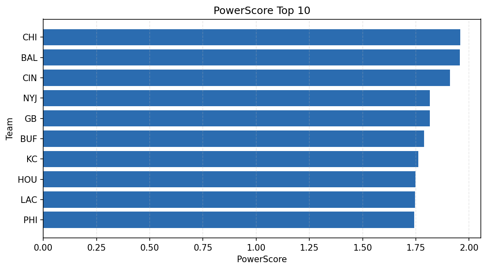

# Weekly Report - Season 2022, Week 9

_Generated at 2025-11-11T12:24:28.526928+00:00 (UTC)_

Data root: `data`

## Layer Shapes

| Layer | Artifact | Manifest | Rows | Columns | Status |
|-------|----------|----------|------|---------|--------|
| L1 Ingest | `data\l1\2022\9.parquet` | `data\l1\2022\9_manifest.json` | 2238 | 18 | ready |
| L2 Clean | `data\l2\2022\9.parquet` | `data\l2\2022\9_manifest.json` | 2238 | 24 | ready |
| L3 Team Week | `data\l3_team_week\2022\9.parquet` | `data\l3_team_week\2022\9_manifest.json` | 26 | 34 | ready |

## L2 Audit Snapshot

Last 3 entries from `data\l2_audit\2022\9_audit.jsonl`:

- {"step": "load", "details": "Loaded L1 parquet", "rows": 2238, "cols": 18, "timestamp": "2025-11-11T12:24:28.087617+00:00"}
- {"step": "prepare", "details": "Normalized team aliases, filtered season/week, deduplicated keys", "rows": 2238, "cols": 24, "rows_removed": 0, "timestamp": "2025-11-11T12:24:28.087617+00:00"}
- {"step": "validate", "details": "Validated against L2 contract and guardrails", "rows": 2238, "cols": 24, "timestamp": "2025-11-11T12:24:28.087617+00:00"}

## L3 Sanity

- Rows processed: 26
- Columns available: 34
- Artifact path: `data\l3_team_week\2022\9.parquet`

## Metrics Snapshot

### L4 Core12 Preview

- Artifact: `data\l4_core12\2022\9.parquet`
- Manifest: `data\l4_core12\2022\9_manifest.json`
- Rows: N/A
- Columns: N/A

| TEAM | core_epa_off | core_sr_off | core_sr_def |
| --- | --- | --- | --- |
| CIN | 0.2235205003901595 | 0.5806451612903226 | 0.3787878787878788 |
| MIA | 0.20398213493991907 | 0.43661971830985913 | 0.42696629213483145 |
| PHI | 0.12221494338274756 | 0.5443037974683544 | 0.43243243243243246 |
| BAL | 0.1212007033116207 | 0.4878048780487805 | 0.38571428571428573 |
| CHI | 0.08750499356433414 | 0.42696629213483145 | 0.43661971830985913 |

### PowerScore Rankings

- Artifact: `data\l4_powerscore\2022\9.parquet`
- Manifest: `data\l4_powerscore\2022\9_manifest.json`
- Rows: 26
- Columns: 4

| team | power_score |
| --- | --- |
| CIN | 0.2440223415000983 |
| MIA | 0.23185249242071174 |
| CHI | 0.20063665788156815 |
| PHI | 0.19581268914754424 |
| JAX | 0.1843754159799216 |
| NYJ | 0.1737836339934729 |
| BAL | 0.15390197334110167 |
| CAR | 0.14925526853583443 |
| BUF | 0.14171386000079414 |
| LV | 0.14107403478447483 |

## Visualizations

