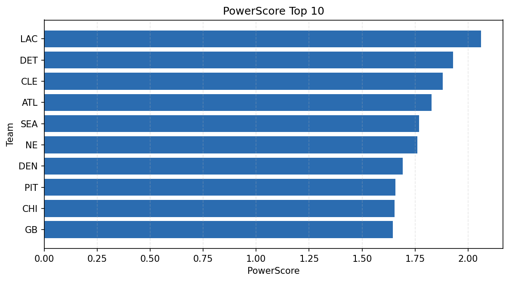

# Weekly Report - Season 2023, Week 10

_Generated at 2025-11-10T20:38:45.004763+00:00 (UTC)_

Data root: `data`

## Layer Shapes

| Layer | Artifact | Manifest | Rows | Columns | Status |
|-------|----------|----------|------|---------|--------|
| L1 Ingest | `data\l1\2023\10.parquet` | `data\l1\2023\10_manifest.json` | 2479 | 18 | ready |
| L2 Clean | `data\l2\2023\10.parquet` | `data\l2\2023\10_manifest.json` | 2479 | 24 | ready |
| L3 Team Week | `data\l3_team_week\2023\10.parquet` | `data\l3_team_week\2023\10_manifest.json` | 28 | 34 | ready |

## L2 Audit Snapshot

Last 3 entries from `data\l2_audit\2023\10_audit.jsonl`:

- {"step": "load", "details": "Loaded L1 parquet", "rows": 2479, "cols": 18, "timestamp": "2025-11-10T20:38:44.483998+00:00"}
- {"step": "prepare", "details": "Normalized team aliases, filtered season/week, deduplicated keys", "rows": 2479, "cols": 24, "rows_removed": 0, "timestamp": "2025-11-10T20:38:44.483998+00:00"}
- {"step": "validate", "details": "Validated against L2 contract and guardrails", "rows": 2479, "cols": 24, "timestamp": "2025-11-10T20:38:44.483998+00:00"}

## L3 Sanity

- Rows processed: 28
- Columns available: 34
- Artifact path: `data\l3_team_week\2023\10.parquet`

## Metrics Snapshot

### L4 Core12 Preview

- Artifact: `data\l4_core12\2023\10.parquet`
- Manifest: `data\l4_core12\2023\10_manifest.json`
- Rows: N/A
- Columns: N/A

| TEAM | core_epa_off | core_sr_off | core_sr_def |
| --- | --- | --- | --- |
| DET | 0.3248018369351218 | 0.524390243902439 | 0.4777777777777778 |
| DAL | 0.24529108367810246 | 0.5268817204301075 | 0.3333333333333333 |
| SF | 0.23170824700345596 | 0.4666666666666667 | 0.3013698630136986 |
| LAC | 0.21861676566509736 | 0.4777777777777778 | 0.524390243902439 |
| WAS | 0.10685103861615061 | 0.4375 | 0.4519230769230769 |

### PowerScore Rankings

- Artifact: `data\l4_powerscore\2023\10.parquet`
- Manifest: `data\l4_powerscore\2023\10_manifest.json`
- Rows: 28
- Columns: 4

| team | power_score |
| --- | --- |
| DET | 0.3177698497188487 |
| LAC | 0.2831429020364751 |
| DAL | 0.22586388618908118 |
| SEA | 0.19745313534226555 |
| HOU | 0.19297501604577444 |
| PIT | 0.19099150101712797 |
| WAS | 0.18884772325400262 |
| SF | 0.17467950137610203 |
| CIN | 0.1635272872458281 |
| CLE | 0.15750595172466067 |

## Visualizations

