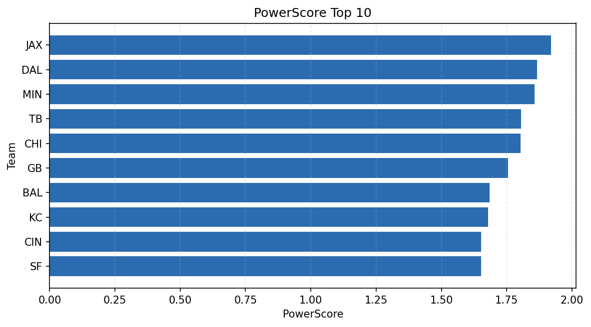

# Weekly Report - Season 2023, Week 11

_Generated at 2026-01-02T10:26:48.066779+00:00 (UTC)_

Data root: `data`

## Layer Shapes

| Layer | Artifact | Manifest | Rows | Columns | Status |
|-------|----------|----------|------|---------|--------|
| L1 Ingest | `data\l1\2023\11.parquet` | `data\l1\2023\11_manifest.json` | 2410 | 18 | ready |
| L2 Clean | `data\l2\2023\11.parquet` | `data\l2\2023\11_manifest.json` | 2410 | 24 | ready |
| L3 Team Week | `data\l3_team_week\2023\11.parquet` | `data\l3_team_week\2023\11_manifest.json` | 28 | 34 | ready |

## L2 Audit Snapshot

Last 3 entries from `data\l2_audit\2023\11_audit.jsonl`:

- {"step": "load", "details": "Loaded L1 parquet", "rows": 2410, "cols": 18, "timestamp": "2026-01-02T10:26:47.634502+00:00"}
- {"step": "prepare", "details": "Normalized team aliases, filtered season/week, deduplicated keys", "rows": 2410, "cols": 24, "rows_removed": 0, "timestamp": "2026-01-02T10:26:47.634502+00:00"}
- {"step": "validate", "details": "Validated against L2 contract and guardrails", "rows": 2410, "cols": 24, "timestamp": "2026-01-02T10:26:47.634502+00:00"}

## L3 Sanity

- Rows processed: 28
- Columns available: 34
- Artifact path: `data\l3_team_week\2023\11.parquet`

## Metrics Snapshot

### L4 Core12 Preview

- Artifact: `data\l4_core12\2023\11.parquet`
- Manifest: `data\l4_core12\2023\11_manifest.json`
- Rows: 28
- Columns: 27

| TEAM | core_epa_off | core_sr_off | core_sr_def |
| --- | --- | --- | --- |
| JAX | 0.31209720766526605 | 0.4880952380952381 | 0.38333333333333336 |
| DAL | 0.16022337277302112 | 0.4367816091954023 | 0.3815789473684211 |
| BAL | 0.15139809104961804 | 0.4939759036144578 | 0.39285714285714285 |
| SF | 0.13321212241174402 | 0.5405405405405406 | 0.4642857142857143 |
| BUF | 0.06484686397016048 | 0.3695652173913043 | 0.2602739726027397 |

### PowerScore Rankings

- Artifact: `data\l4_powerscore\2023\11.parquet`
- Manifest: `data\l4_powerscore\2023\11_manifest.json`
- Rows: 28
- Columns: 4

| team | power_score |
| --- | --- |
| JAX | 1.9202470552870297 |
| DAL | 1.8661522193054494 |
| MIN | 1.856388370584046 |
| TB | 1.804693877974166 |
| CHI | 1.802658244582245 |
| GB | 1.755417530558107 |
| BAL | 1.6839617274729892 |
| KC | 1.6795487110932663 |
| CIN | 1.6529447747663601 |
| SF | 1.6514622493623248 |

## Visualizations

