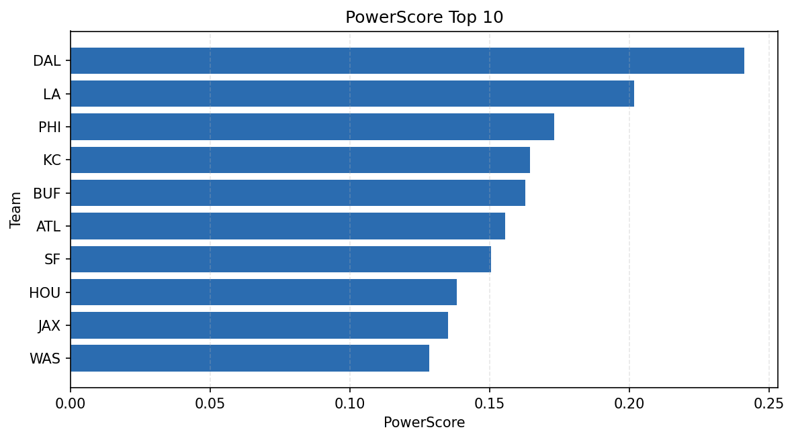

# Weekly Report - Season 2023, Week 12

_Generated at 2026-01-02T10:27:40.206185+00:00 (UTC)_

Data root: `data`

## Layer Shapes

| Layer | Artifact | Manifest | Rows | Columns | Status |
|-------|----------|----------|------|---------|--------|
| L1 Ingest | `data\l1\2023\12.parquet` | `data\l1\2023\12_manifest.json` | 2756 | 18 | ready |
| L2 Clean | `data\l2\2023\12.parquet` | `data\l2\2023\12_manifest.json` | 2756 | 24 | ready |
| L3 Team Week | `data\l3_team_week\2023\12.parquet` | `data\l3_team_week\2023\12_manifest.json` | 32 | 34 | ready |

## L2 Audit Snapshot

Last 3 entries from `data\l2_audit\2023\12_audit.jsonl`:

- {"step": "load", "details": "Loaded L1 parquet", "rows": 2756, "cols": 18, "timestamp": "2026-01-02T10:27:39.827145+00:00"}
- {"step": "prepare", "details": "Normalized team aliases, filtered season/week, deduplicated keys", "rows": 2756, "cols": 24, "rows_removed": 0, "timestamp": "2026-01-02T10:27:39.827145+00:00"}
- {"step": "validate", "details": "Validated against L2 contract and guardrails", "rows": 2756, "cols": 24, "timestamp": "2026-01-02T10:27:39.827145+00:00"}

## L3 Sanity

- Rows processed: 32
- Columns available: 34
- Artifact path: `data\l3_team_week\2023\12.parquet`

## Metrics Snapshot

### L4 Core12 Preview

- Artifact: `data\l4_core12\2023\12.parquet`
- Manifest: `data\l4_core12\2023\12_manifest.json`
- Rows: 32
- Columns: 27

| TEAM | core_epa_off | core_sr_off | core_sr_def |
| --- | --- | --- | --- |
| DAL | 0.31827550985451253 | 0.5142857142857142 | 0.425531914893617 |
| LA | 0.2144157783705977 | 0.5443037974683544 | 0.3333333333333333 |
| KC | 0.13211967342521075 | 0.4805194805194805 | 0.30985915492957744 |
| SF | 0.11833758468137068 | 0.47058823529411764 | 0.4520547945205479 |
| PHI | 0.08673964545465587 | 0.43820224719101125 | 0.42735042735042733 |

### PowerScore Rankings

- Artifact: `data\l4_powerscore\2023\12.parquet`
- Manifest: `data\l4_powerscore\2023\12_manifest.json`
- Rows: 32
- Columns: 4

| team | power_score |
| --- | --- |
| NO | 1.820083185563427 |
| CAR | 1.816880601968831 |
| WAS | 1.816279334153722 |
| BUF | 1.8102297216901524 |
| DET | 1.7938677348198233 |
| PIT | 1.773721254849474 |
| JAX | 1.7721255888044092 |
| LA | 1.7615632227346638 |
| ARI | 1.7108531895123547 |
| KC | 1.6863568102326572 |

## Visualizations

