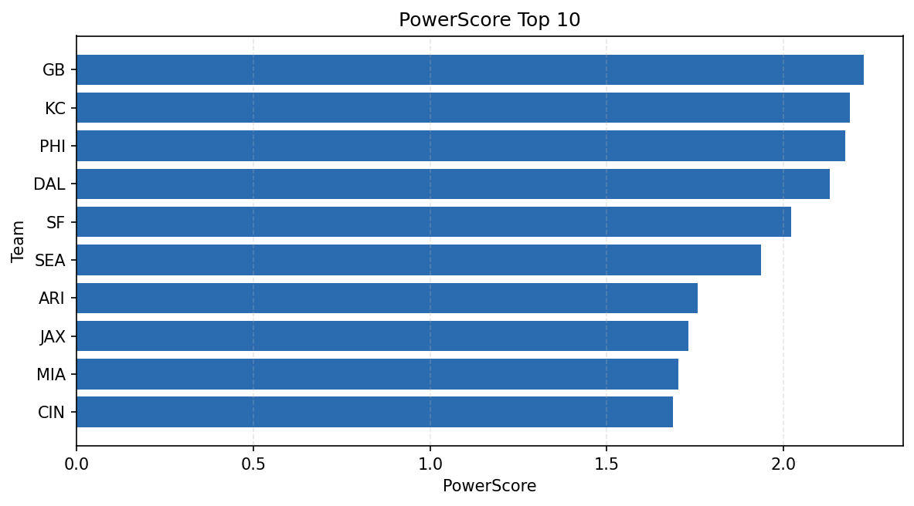

# Weekly Report - Season 2023, Week 13

_Generated at 2025-11-10T20:39:17.897187+00:00 (UTC)_

Data root: `data`

## Layer Shapes

| Layer | Artifact | Manifest | Rows | Columns | Status |
|-------|----------|----------|------|---------|--------|
| L1 Ingest | `data\l1\2023\13.parquet` | `data\l1\2023\13_manifest.json` | 2329 | 18 | ready |
| L2 Clean | `data\l2\2023\13.parquet` | `data\l2\2023\13_manifest.json` | 2329 | 24 | ready |
| L3 Team Week | `data\l3_team_week\2023\13.parquet` | `data\l3_team_week\2023\13_manifest.json` | 26 | 34 | ready |

## L2 Audit Snapshot

Last 3 entries from `data\l2_audit\2023\13_audit.jsonl`:

- {"step": "load", "details": "Loaded L1 parquet", "rows": 2329, "cols": 18, "timestamp": "2025-11-10T20:39:17.417975+00:00"}
- {"step": "prepare", "details": "Normalized team aliases, filtered season/week, deduplicated keys", "rows": 2329, "cols": 24, "rows_removed": 0, "timestamp": "2025-11-10T20:39:17.417975+00:00"}
- {"step": "validate", "details": "Validated against L2 contract and guardrails", "rows": 2329, "cols": 24, "timestamp": "2025-11-10T20:39:17.417975+00:00"}

## L3 Sanity

- Rows processed: 26
- Columns available: 34
- Artifact path: `data\l3_team_week\2023\13.parquet`

## Metrics Snapshot

### L4 Core12 Preview

- Artifact: `data\l4_core12\2023\13.parquet`
- Manifest: `data\l4_core12\2023\13_manifest.json`
- Rows: N/A
- Columns: N/A

| TEAM | core_epa_off | core_sr_off | core_sr_def |
| --- | --- | --- | --- |
| SF | 0.4227630359592376 | 0.5974025974025974 | 0.3595505617977528 |
| MIA | 0.35179308375242996 | 0.527027027027027 | 0.2602739726027397 |
| GB | 0.23253180336250806 | 0.475 | 0.4810126582278481 |
| DAL | 0.1899612019814196 | 0.5142857142857142 | 0.4367816091954023 |
| CIN | 0.13928279202017518 | 0.5 | 0.44680851063829785 |

### PowerScore Rankings

- Artifact: `data\l4_powerscore\2023\13.parquet`
- Manifest: `data\l4_powerscore\2023\13_manifest.json`
- Rows: 26
- Columns: 4

| team | power_score |
| --- | --- |
| SF | 0.34416089981156167 |
| GB | 0.2494933985562731 |
| MIA | 0.2461640932413696 |
| DAL | 0.24191437564514978 |
| KC | 0.2340129077003674 |
| PHI | 0.2153024454218279 |
| SEA | 0.21194518455018235 |
| CIN | 0.21028002517879116 |
| JAX | 0.19013104601886482 |
| LA | 0.12562198478717118 |

## Visualizations

