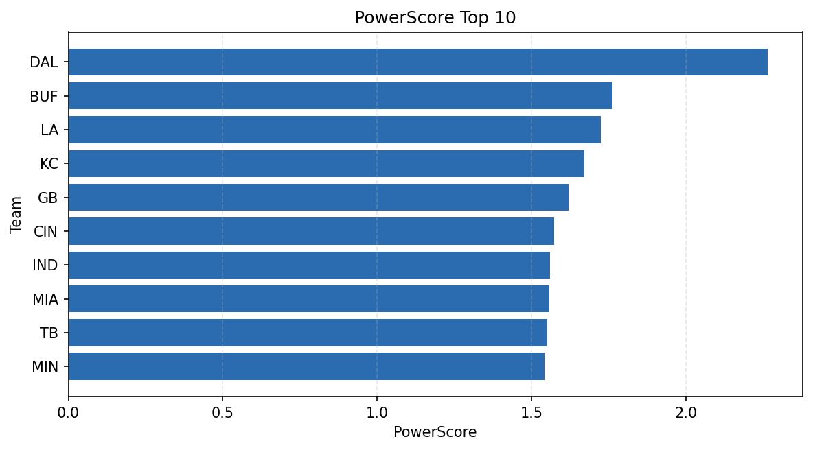

# Weekly Report - Season 2023, Week 14

_Generated at 2026-01-02T11:04:34.796935+00:00 (UTC)_

Data root: `data`

## Layer Shapes

| Layer | Artifact | Manifest | Rows | Columns | Status |
|-------|----------|----------|------|---------|--------|
| L1 Ingest | `data\l1\2023\14.parquet` | `data\l1\2023\14_manifest.json` | 2664 | 18 | ready |
| L2 Clean | `data\l2\2023\14.parquet` | `data\l2\2023\14_manifest.json` | 2664 | 24 | ready |
| L3 Team Week | `data\l3_team_week\2023\14.parquet` | `data\l3_team_week\2023\14_manifest.json` | 30 | 34 | ready |

## L2 Audit Snapshot

Last 3 entries from `data\l2_audit\2023\14_audit.jsonl`:

- {"step": "load", "details": "Loaded L1 parquet", "rows": 2664, "cols": 18, "timestamp": "2026-01-02T11:04:34.423151+00:00"}
- {"step": "prepare", "details": "Normalized team aliases, filtered season/week, deduplicated keys", "rows": 2664, "cols": 24, "rows_removed": 0, "timestamp": "2026-01-02T11:04:34.423151+00:00"}
- {"step": "validate", "details": "Validated against L2 contract and guardrails", "rows": 2664, "cols": 24, "timestamp": "2026-01-02T11:04:34.423151+00:00"}

## L3 Sanity

- Rows processed: 30
- Columns available: 34
- Artifact path: `data\l3_team_week\2023\14.parquet`

## Metrics Snapshot

### L4 Core12 Preview

- Artifact: `data\l4_core12\2023\14.parquet`
- Manifest: `data\l4_core12\2023\14_manifest.json`
- Rows: 30
- Columns: 27

| TEAM | core_epa_off | core_sr_off | core_sr_def |
| --- | --- | --- | --- |
| CIN | 0.1573409424038144 | 0.43037974683544306 | 0.3950617283950617 |
| BAL | 0.1297845631311445 | 0.40217391304347827 | 0.4215686274509804 |
| SF | 0.12426451868506977 | 0.4305555555555556 | 0.3918918918918919 |
| DAL | 0.1178323089213033 | 0.4791666666666667 | 0.3888888888888889 |
| LA | 0.06709845386007253 | 0.4215686274509804 | 0.40217391304347827 |

### PowerScore Rankings

- Artifact: `data\l4_powerscore\2023\14.parquet`
- Manifest: `data\l4_powerscore\2023\14_manifest.json`
- Rows: 30
- Columns: 4

| team | power_score |
| --- | --- |
| DAL | 2.2641366196827826 |
| BUF | 1.7605751497039819 |
| LA | 1.7240642975707685 |
| KC | 1.6715113565313158 |
| GB | 1.6186429091338264 |
| CIN | 1.5735525676501048 |
| IND | 1.5583790565952778 |
| MIA | 1.558142573590255 |
| TB | 1.5512461323564366 |
| MIN | 1.5411243196283606 |

## Visualizations

