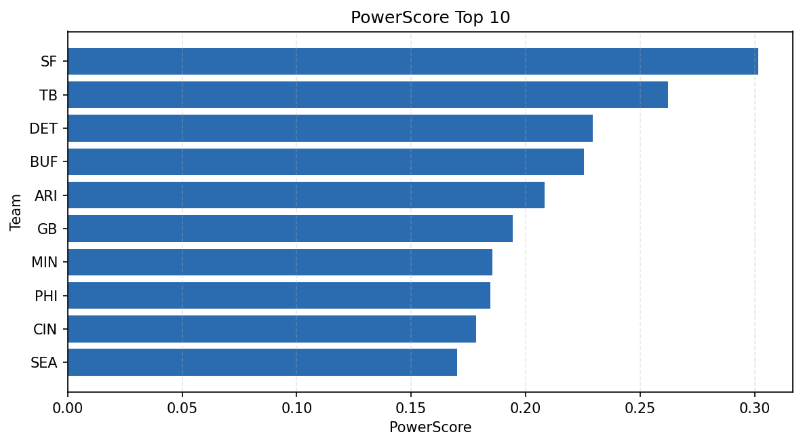

# Weekly Report - Season 2023, Week 15

_Generated at 2025-11-10T20:39:40.732576+00:00 (UTC)_

Data root: `data`

## Layer Shapes

| Layer | Artifact | Manifest | Rows | Columns | Status |
|-------|----------|----------|------|---------|--------|
| L1 Ingest | `data\l1\2023\15.parquet` | `data\l1\2023\15_manifest.json` | 2738 | 18 | ready |
| L2 Clean | `data\l2\2023\15.parquet` | `data\l2\2023\15_manifest.json` | 2738 | 24 | ready |
| L3 Team Week | `data\l3_team_week\2023\15.parquet` | `data\l3_team_week\2023\15_manifest.json` | 32 | 34 | ready |

## L2 Audit Snapshot

Last 3 entries from `data\l2_audit\2023\15_audit.jsonl`:

- {"step": "load", "details": "Loaded L1 parquet", "rows": 2738, "cols": 18, "timestamp": "2025-11-10T20:39:40.122915+00:00"}
- {"step": "prepare", "details": "Normalized team aliases, filtered season/week, deduplicated keys", "rows": 2738, "cols": 24, "rows_removed": 0, "timestamp": "2025-11-10T20:39:40.122915+00:00"}
- {"step": "validate", "details": "Validated against L2 contract and guardrails", "rows": 2738, "cols": 24, "timestamp": "2025-11-10T20:39:40.122915+00:00"}

## L3 Sanity

- Rows processed: 32
- Columns available: 34
- Artifact path: `data\l3_team_week\2023\15.parquet`

## Metrics Snapshot

### L4 Core12 Preview

- Artifact: `data\l4_core12\2023\15.parquet`
- Manifest: `data\l4_core12\2023\15_manifest.json`
- Rows: N/A
- Columns: N/A

| TEAM | core_epa_off | core_sr_off | core_sr_def |
| --- | --- | --- | --- |
| SF | 0.3354133638515048 | 0.5342465753424658 | 0.40217391304347827 |
| TB | 0.2722720303270337 | 0.4935064935064935 | 0.4155844155844156 |
| DET | 0.24094964597351487 | 0.5 | 0.3950617283950617 |
| LV | 0.23328009012731768 | 0.5119047619047619 | 0.3977272727272727 |
| BUF | 0.2238824479736206 | 0.524390243902439 | 0.42857142857142855 |

### PowerScore Rankings

- Artifact: `data\l4_powerscore\2023\15.parquet`
- Manifest: `data\l4_powerscore\2023\15_manifest.json`
- Rows: 32
- Columns: 4

| team | power_score |
| --- | --- |
| SF | 0.3016286151588491 |
| TB | 0.26232530671208126 |
| DET | 0.22929272011860274 |
| BUF | 0.22557657135277337 |
| ARI | 0.2082979007468638 |
| GB | 0.1944843469635136 |
| MIN | 0.18540264680327492 |
| PHI | 0.18454316217411199 |
| CIN | 0.17837798395851695 |
| SEA | 0.1699936570510994 |

## Visualizations

