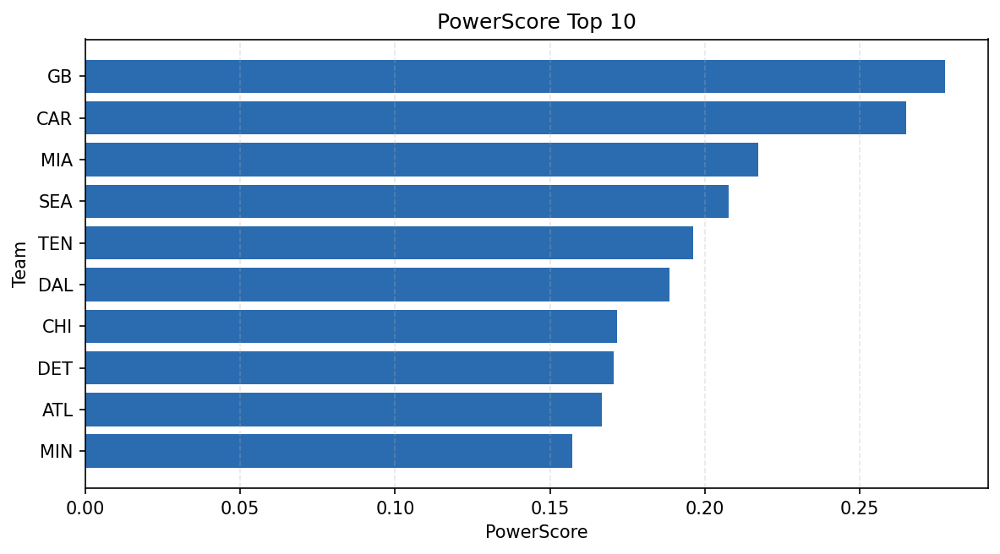

# Weekly Report - Season 2023, Week 16

_Generated at 2026-01-02T11:06:39.832522+00:00 (UTC)_

Data root: `data`

## Layer Shapes

| Layer | Artifact | Manifest | Rows | Columns | Status |
|-------|----------|----------|------|---------|--------|
| L1 Ingest | `data\l1\2023\16.parquet` | `data\l1\2023\16_manifest.json` | 2844 | 18 | ready |
| L2 Clean | `data\l2\2023\16.parquet` | `data\l2\2023\16_manifest.json` | 2844 | 24 | ready |
| L3 Team Week | `data\l3_team_week\2023\16.parquet` | `data\l3_team_week\2023\16_manifest.json` | 32 | 34 | ready |

## L2 Audit Snapshot

Last 3 entries from `data\l2_audit\2023\16_audit.jsonl`:

- {"step": "load", "details": "Loaded L1 parquet", "rows": 2844, "cols": 18, "timestamp": "2026-01-02T11:06:39.393725+00:00"}
- {"step": "prepare", "details": "Normalized team aliases, filtered season/week, deduplicated keys", "rows": 2844, "cols": 24, "rows_removed": 0, "timestamp": "2026-01-02T11:06:39.393725+00:00"}
- {"step": "validate", "details": "Validated against L2 contract and guardrails", "rows": 2844, "cols": 24, "timestamp": "2026-01-02T11:06:39.393725+00:00"}

## L3 Sanity

- Rows processed: 32
- Columns available: 34
- Artifact path: `data\l3_team_week\2023\16.parquet`

## Metrics Snapshot

### L4 Core12 Preview

- Artifact: `data\l4_core12\2023\16.parquet`
- Manifest: `data\l4_core12\2023\16_manifest.json`
- Rows: 32
- Columns: 27

| TEAM | core_epa_off | core_sr_off | core_sr_def |
| --- | --- | --- | --- |
| GB | 0.24581403524747916 | 0.5 | 0.4642857142857143 |
| CAR | 0.1895457417593293 | 0.4642857142857143 | 0.5 |
| SEA | 0.16559620554509916 | 0.4605263157894737 | 0.4819277108433735 |
| PIT | 0.15321898190925518 | 0.4533333333333333 | 0.38961038961038963 |
| MIA | 0.1256160243760749 | 0.5 | 0.43902439024390244 |

### PowerScore Rankings

- Artifact: `data\l4_powerscore\2023\16.parquet`
- Manifest: `data\l4_powerscore\2023\16_manifest.json`
- Rows: 32
- Columns: 4

| team | power_score |
| --- | --- |
| SEA | 2.360553038230967 |
| TEN | 2.256661046669788 |
| DAL | 1.9986385211493027 |
| DET | 1.9872466308829861 |
| GB | 1.9289440606884838 |
| CAR | 1.9115752452366899 |
| LA | 1.8649129775682307 |
| MIA | 1.832701035097849 |
| ATL | 1.7953090330743868 |
| TB | 1.7402464021084665 |

## Visualizations

