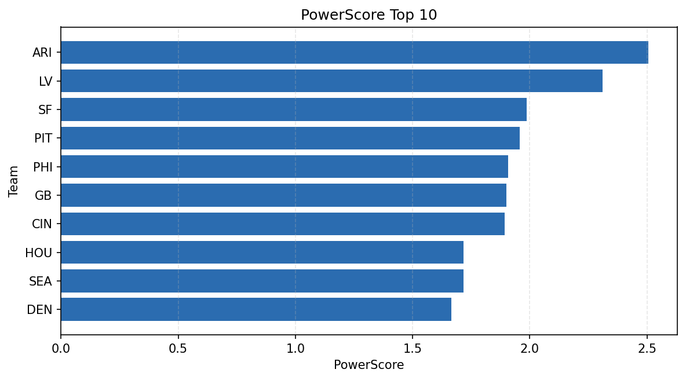

# Weekly Report - Season 2023, Week 17

_Generated at 2026-01-02T11:07:49.476434+00:00 (UTC)_

Data root: `data`

## Layer Shapes

| Layer | Artifact | Manifest | Rows | Columns | Status |
|-------|----------|----------|------|---------|--------|
| L1 Ingest | `data\l1\2023\17.parquet` | `data\l1\2023\17_manifest.json` | 2692 | 18 | ready |
| L2 Clean | `data\l2\2023\17.parquet` | `data\l2\2023\17_manifest.json` | 2692 | 24 | ready |
| L3 Team Week | `data\l3_team_week\2023\17.parquet` | `data\l3_team_week\2023\17_manifest.json` | 32 | 34 | ready |

## L2 Audit Snapshot

Last 3 entries from `data\l2_audit\2023\17_audit.jsonl`:

- {"step": "load", "details": "Loaded L1 parquet", "rows": 2692, "cols": 18, "timestamp": "2026-01-02T11:07:48.892488+00:00"}
- {"step": "prepare", "details": "Normalized team aliases, filtered season/week, deduplicated keys", "rows": 2692, "cols": 24, "rows_removed": 0, "timestamp": "2026-01-02T11:07:48.892488+00:00"}
- {"step": "validate", "details": "Validated against L2 contract and guardrails", "rows": 2692, "cols": 24, "timestamp": "2026-01-02T11:07:48.892488+00:00"}

## L3 Sanity

- Rows processed: 32
- Columns available: 34
- Artifact path: `data\l3_team_week\2023\17.parquet`

## Metrics Snapshot

### L4 Core12 Preview

- Artifact: `data\l4_core12\2023\17.parquet`
- Manifest: `data\l4_core12\2023\17_manifest.json`
- Rows: 32
- Columns: 27

| TEAM | core_epa_off | core_sr_off | core_sr_def |
| --- | --- | --- | --- |
| BAL | 0.38597030395811255 | 0.5194805194805194 | 0.4090909090909091 |
| ARI | 0.24803754686262836 | 0.5842696629213483 | 0.5 |
| PHI | 0.2345203900794414 | 0.5 | 0.5842696629213483 |
| PIT | 0.19169500523685723 | 0.5287356321839081 | 0.463768115942029 |
| GB | 0.19106717908690715 | 0.5172413793103449 | 0.35714285714285715 |

### PowerScore Rankings

- Artifact: `data\l4_powerscore\2023\17.parquet`
- Manifest: `data\l4_powerscore\2023\17_manifest.json`
- Rows: 32
- Columns: 4

| team | power_score |
| --- | --- |
| ARI | 2.5047846351481455 |
| LV | 2.309251219735301 |
| SF | 1.9854847539386298 |
| PIT | 1.95631025491987 |
| PHI | 1.9066896459003302 |
| GB | 1.9001849499770573 |
| CIN | 1.8930279071879734 |
| HOU | 1.7178087789383352 |
| SEA | 1.71742227968795 |
| DEN | 1.6651496203757568 |

## Visualizations

