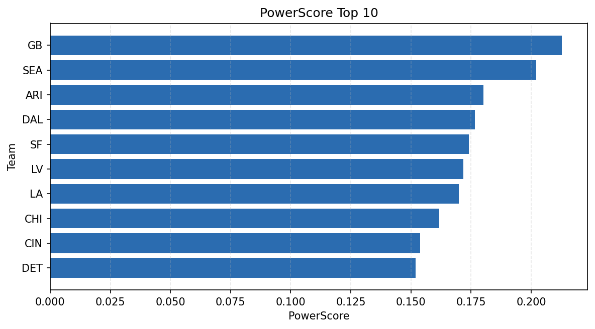

# Weekly Report - Season 2023, Week 18

_Generated at 2025-11-10T20:40:17.033838+00:00 (UTC)_

Data root: `data`

## Layer Shapes

| Layer | Artifact | Manifest | Rows | Columns | Status |
|-------|----------|----------|------|---------|--------|
| L1 Ingest | `data\l1\2023\18.parquet` | `data\l1\2023\18_manifest.json` | 2640 | 18 | ready |
| L2 Clean | `data\l2\2023\18.parquet` | `data\l2\2023\18_manifest.json` | 2640 | 24 | ready |
| L3 Team Week | `data\l3_team_week\2023\18.parquet` | `data\l3_team_week\2023\18_manifest.json` | 32 | 34 | ready |

## L2 Audit Snapshot

Last 3 entries from `data\l2_audit\2023\18_audit.jsonl`:

- {"step": "load", "details": "Loaded L1 parquet", "rows": 2640, "cols": 18, "timestamp": "2025-11-10T20:40:16.492933+00:00"}
- {"step": "prepare", "details": "Normalized team aliases, filtered season/week, deduplicated keys", "rows": 2640, "cols": 24, "rows_removed": 0, "timestamp": "2025-11-10T20:40:16.492933+00:00"}
- {"step": "validate", "details": "Validated against L2 contract and guardrails", "rows": 2640, "cols": 24, "timestamp": "2025-11-10T20:40:16.492933+00:00"}

## L3 Sanity

- Rows processed: 32
- Columns available: 34
- Artifact path: `data\l3_team_week\2023\18.parquet`

## Metrics Snapshot

### L4 Core12 Preview

- Artifact: `data\l4_core12\2023\18.parquet`
- Manifest: `data\l4_core12\2023\18_manifest.json`
- Rows: N/A
- Columns: N/A

| TEAM | core_epa_off | core_sr_off | core_sr_def |
| --- | --- | --- | --- |
| DAL | 0.1684539710071736 | 0.6071428571428571 | 0.34375 |
| NO | 0.15455970197413746 | 0.4606741573033708 | 0.35 |
| LV | 0.13444607504815967 | 0.4444444444444444 | 0.41333333333333333 |
| GB | 0.12456121182312137 | 0.5217391304347826 | 0.4666666666666667 |
| SEA | 0.10604292739127927 | 0.47058823529411764 | 0.4044943820224719 |

### PowerScore Rankings

- Artifact: `data\l4_powerscore\2023\18.parquet`
- Manifest: `data\l4_powerscore\2023\18_manifest.json`
- Rows: 32
- Columns: 4

| team | power_score |
| --- | --- |
| GB | 0.21276711744836707 |
| SEA | 0.2021273011530433 |
| ARI | 0.18006433913184444 |
| DAL | 0.17665986459524857 |
| SF | 0.17411263743857855 |
| LV | 0.17169865536703555 |
| LA | 0.1698880289968556 |
| CHI | 0.16183052087499614 |
| CIN | 0.15377242420181672 |
| DET | 0.15191131365122587 |

## Visualizations

