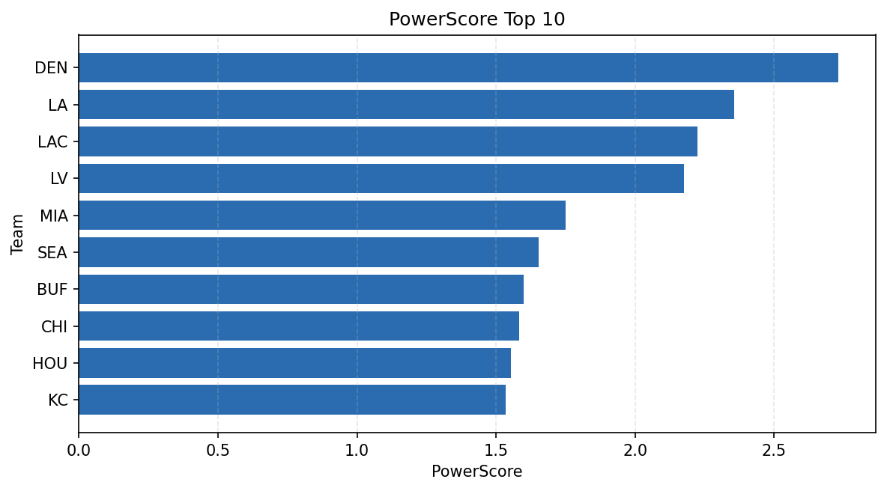

# Weekly Report - Season 2023, Week 1

_Generated at 2025-11-10T20:37:07.060444+00:00 (UTC)_

Data root: `data`

## Layer Shapes

| Layer | Artifact | Manifest | Rows | Columns | Status |
|-------|----------|----------|------|---------|--------|
| L1 Ingest | `data\l1\2023\1.parquet` | `data\l1\2023\1_manifest.json` | 2816 | 18 | ready |
| L2 Clean | `data\l2\2023\1.parquet` | `data\l2\2023\1_manifest.json` | 2816 | 24 | ready |
| L3 Team Week | `data\l3_team_week\2023\1.parquet` | `data\l3_team_week\2023\1_manifest.json` | 32 | 34 | ready |

## L2 Audit Snapshot

Last 3 entries from `data\l2_audit\2023\1_audit.jsonl`:

- {"step": "load", "details": "Loaded L1 parquet", "rows": 2816, "cols": 18, "timestamp": "2025-11-10T20:37:06.371840+00:00"}
- {"step": "prepare", "details": "Normalized team aliases, filtered season/week, deduplicated keys", "rows": 2816, "cols": 24, "rows_removed": 0, "timestamp": "2025-11-10T20:37:06.371840+00:00"}
- {"step": "validate", "details": "Validated against L2 contract and guardrails", "rows": 2816, "cols": 24, "timestamp": "2025-11-10T20:37:06.371840+00:00"}

## L3 Sanity

- Rows processed: 32
- Columns available: 34
- Artifact path: `data\l3_team_week\2023\1.parquet`

## Metrics Snapshot

### L4 Core12 Preview

- Artifact: `data\l4_core12\2023\1.parquet`
- Manifest: `data\l4_core12\2023\1_manifest.json`
- Rows: N/A
- Columns: N/A

| TEAM | core_epa_off | core_sr_off | core_sr_def |
| --- | --- | --- | --- |
| MIA | 0.21891781653366274 | 0.47619047619047616 | 0.54 |
| LA | 0.18930464133392183 | 0.5 | 0.5 |
| LAC | 0.1311960656568408 | 0.54 | 0.47619047619047616 |
| LV | 0.12183892158102769 | 0.36619718309859156 | 0.4675324675324675 |
| GB | 0.11037227725963804 | 0.3924050632911392 | 0.4065934065934066 |

### PowerScore Rankings

- Artifact: `data\l4_powerscore\2023\1.parquet`
- Manifest: `data\l4_powerscore\2023\1_manifest.json`
- Rows: 32
- Columns: 4

| team | power_score |
| --- | --- |
| MIA | 0.2695271155848168 |
| LAC | 0.24470218628662682 |
| LA | 0.1978073285983446 |
| DEN | 0.18388400942705388 |
| LV | 0.16076536105512435 |
| SEA | 0.15100533276576786 |
| GB | 0.12183369423344 |
| SF | 0.11061435741793554 |
| BUF | 0.09461152717445254 |
| NYJ | 0.08855619756939141 |

## Visualizations

