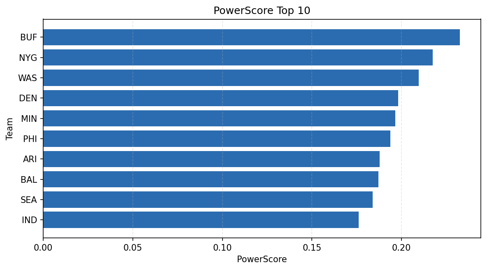

# Weekly Report - Season 2023, Week 2

_Generated at 2025-11-10T20:37:17.228106+00:00 (UTC)_

Data root: `data`

## Layer Shapes

| Layer | Artifact | Manifest | Rows | Columns | Status |
|-------|----------|----------|------|---------|--------|
| L1 Ingest | `data\l1\2023\2.parquet` | `data\l1\2023\2_manifest.json` | 2844 | 18 | ready |
| L2 Clean | `data\l2\2023\2.parquet` | `data\l2\2023\2_manifest.json` | 2844 | 24 | ready |
| L3 Team Week | `data\l3_team_week\2023\2.parquet` | `data\l3_team_week\2023\2_manifest.json` | 32 | 34 | ready |

## L2 Audit Snapshot

Last 3 entries from `data\l2_audit\2023\2_audit.jsonl`:

- {"step": "load", "details": "Loaded L1 parquet", "rows": 2844, "cols": 18, "timestamp": "2025-11-10T20:37:16.829020+00:00"}
- {"step": "prepare", "details": "Normalized team aliases, filtered season/week, deduplicated keys", "rows": 2844, "cols": 24, "rows_removed": 0, "timestamp": "2025-11-10T20:37:16.829020+00:00"}
- {"step": "validate", "details": "Validated against L2 contract and guardrails", "rows": 2844, "cols": 24, "timestamp": "2025-11-10T20:37:16.829020+00:00"}

## L3 Sanity

- Rows processed: 32
- Columns available: 34
- Artifact path: `data\l3_team_week\2023\2.parquet`

## Metrics Snapshot

### L4 Core12 Preview

- Artifact: `data\l4_core12\2023\2.parquet`
- Manifest: `data\l4_core12\2023\2_manifest.json`
- Rows: N/A
- Columns: N/A

| TEAM | core_epa_off | core_sr_off | core_sr_def |
| --- | --- | --- | --- |
| BUF | 0.2603423737657621 | 0.5760869565217391 | 0.4528301886792453 |
| NYG | 0.14376536281231572 | 0.49411764705882355 | 0.40229885057471265 |
| IND | 0.1365886958812674 | 0.4666666666666667 | 0.3883495145631068 |
| WAS | 0.12804002871596684 | 0.46236559139784944 | 0.4457831325301205 |
| PHI | 0.11572834550954249 | 0.4897959183673469 | 0.4657534246575342 |

### PowerScore Rankings

- Artifact: `data\l4_powerscore\2023\2.parquet`
- Manifest: `data\l4_powerscore\2023\2_manifest.json`
- Rows: 32
- Columns: 4

| team | power_score |
| --- | --- |
| BUF | 0.23263581038143832 |
| NYG | 0.21737164140187148 |
| WAS | 0.20949905995122217 |
| DEN | 0.19813933432464645 |
| MIN | 0.19654535254846808 |
| PHI | 0.19365810878541784 |
| ARI | 0.18778749159813063 |
| BAL | 0.18709535181065706 |
| SEA | 0.18383405317167714 |
| IND | 0.17613343741826135 |

## Visualizations

