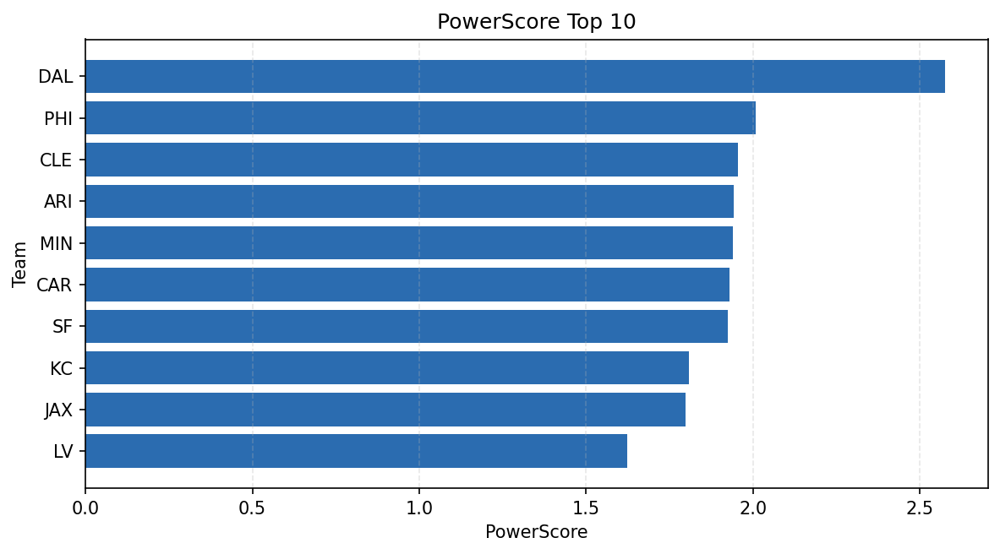

# Weekly Report - Season 2023, Week 3

_Generated at 2025-11-10T20:37:27.707306+00:00 (UTC)_

Data root: `data`

## Layer Shapes

| Layer | Artifact | Manifest | Rows | Columns | Status |
|-------|----------|----------|------|---------|--------|
| L1 Ingest | `data\l1\2023\3.parquet` | `data\l1\2023\3_manifest.json` | 2882 | 18 | ready |
| L2 Clean | `data\l2\2023\3.parquet` | `data\l2\2023\3_manifest.json` | 2882 | 24 | ready |
| L3 Team Week | `data\l3_team_week\2023\3.parquet` | `data\l3_team_week\2023\3_manifest.json` | 32 | 34 | ready |

## L2 Audit Snapshot

Last 3 entries from `data\l2_audit\2023\3_audit.jsonl`:

- {"step": "load", "details": "Loaded L1 parquet", "rows": 2882, "cols": 18, "timestamp": "2025-11-10T20:37:27.306918+00:00"}
- {"step": "prepare", "details": "Normalized team aliases, filtered season/week, deduplicated keys", "rows": 2882, "cols": 24, "rows_removed": 0, "timestamp": "2025-11-10T20:37:27.306918+00:00"}
- {"step": "validate", "details": "Validated against L2 contract and guardrails", "rows": 2882, "cols": 24, "timestamp": "2025-11-10T20:37:27.306918+00:00"}

## L3 Sanity

- Rows processed: 32
- Columns available: 34
- Artifact path: `data\l3_team_week\2023\3.parquet`

## Metrics Snapshot

### L4 Core12 Preview

- Artifact: `data\l4_core12\2023\3.parquet`
- Manifest: `data\l4_core12\2023\3_manifest.json`
- Rows: N/A
- Columns: N/A

| TEAM | core_epa_off | core_sr_off | core_sr_def |
| --- | --- | --- | --- |
| MIA | 0.4726413693679597 | 0.6021505376344086 | 0.34523809523809523 |
| ARI | 0.21176651458088785 | 0.5 | 0.4583333333333333 |
| HOU | 0.20083145920497675 | 0.48 | 0.43010752688172044 |
| KC | 0.17126851026778636 | 0.5108695652173914 | 0.3235294117647059 |
| SEA | 0.16342280152183708 | 0.5268817204301075 | 0.37037037037037035 |

### PowerScore Rankings

- Artifact: `data\l4_powerscore\2023\3.parquet`
- Manifest: `data\l4_powerscore\2023\3_manifest.json`
- Rows: 32
- Columns: 4

| team | power_score |
| --- | --- |
| MIA | 0.3273345805345512 |
| ARI | 0.22981372155422247 |
| SEA | 0.2194158706006793 |
| DAL | 0.19350622289117053 |
| HOU | 0.1879343717349543 |
| SF | 0.16908701179137445 |
| KC | 0.16337436809802375 |
| LAC | 0.1557293599822363 |
| PHI | 0.15239066748173105 |
| DEN | 0.15204529822939944 |

## Visualizations

