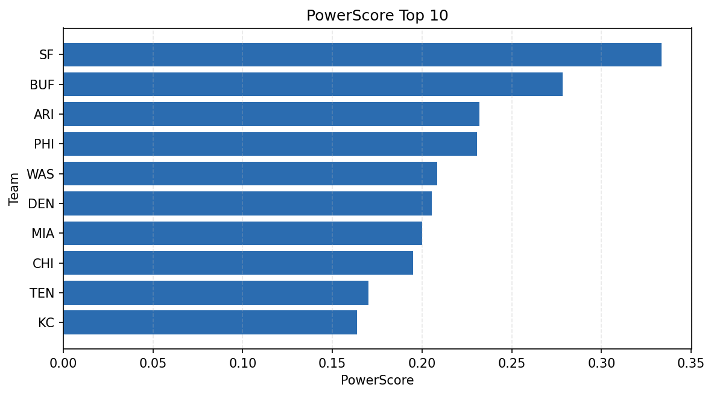

# Weekly Report - Season 2023, Week 4

_Generated at 2025-11-10T20:37:37.959596+00:00 (UTC)_

Data root: `data`

## Layer Shapes

| Layer | Artifact | Manifest | Rows | Columns | Status |
|-------|----------|----------|------|---------|--------|
| L1 Ingest | `data\l1\2023\4.parquet` | `data\l1\2023\4_manifest.json` | 2730 | 18 | ready |
| L2 Clean | `data\l2\2023\4.parquet` | `data\l2\2023\4_manifest.json` | 2730 | 24 | ready |
| L3 Team Week | `data\l3_team_week\2023\4.parquet` | `data\l3_team_week\2023\4_manifest.json` | 32 | 34 | ready |

## L2 Audit Snapshot

Last 3 entries from `data\l2_audit\2023\4_audit.jsonl`:

- {"step": "load", "details": "Loaded L1 parquet", "rows": 2730, "cols": 18, "timestamp": "2025-11-10T20:37:37.498235+00:00"}
- {"step": "prepare", "details": "Normalized team aliases, filtered season/week, deduplicated keys", "rows": 2730, "cols": 24, "rows_removed": 0, "timestamp": "2025-11-10T20:37:37.498235+00:00"}
- {"step": "validate", "details": "Validated against L2 contract and guardrails", "rows": 2730, "cols": 24, "timestamp": "2025-11-10T20:37:37.498235+00:00"}

## L3 Sanity

- Rows processed: 32
- Columns available: 34
- Artifact path: `data\l3_team_week\2023\4.parquet`

## Metrics Snapshot

### L4 Core12 Preview

- Artifact: `data\l4_core12\2023\4.parquet`
- Manifest: `data\l4_core12\2023\4_manifest.json`
- Rows: N/A
- Columns: N/A

| TEAM | core_epa_off | core_sr_off | core_sr_def |
| --- | --- | --- | --- |
| SF | 0.40122498620463454 | 0.5942028985507246 | 0.4418604651162791 |
| BUF | 0.3663669531862881 | 0.5405405405405406 | 0.4268292682926829 |
| PHI | 0.18713169984435768 | 0.47191011235955055 | 0.3979591836734694 |
| DEN | 0.17004734858432236 | 0.4411764705882353 | 0.4444444444444444 |
| TEN | 0.16445115114314646 | 0.4936708860759494 | 0.4696969696969697 |

### PowerScore Rankings

- Artifact: `data\l4_powerscore\2023\4.parquet`
- Manifest: `data\l4_powerscore\2023\4_manifest.json`
- Rows: 32
- Columns: 4

| team | power_score |
| --- | --- |
| SF | 0.33356572191579686 |
| BUF | 0.2783065928727936 |
| ARI | 0.23196490539729414 |
| PHI | 0.23065503329253031 |
| WAS | 0.20843109294519724 |
| DEN | 0.20539190297982857 |
| MIA | 0.20014879821082018 |
| CHI | 0.19510012245307876 |
| TEN | 0.17004765072136568 |
| KC | 0.1636428892491082 |

## Visualizations

