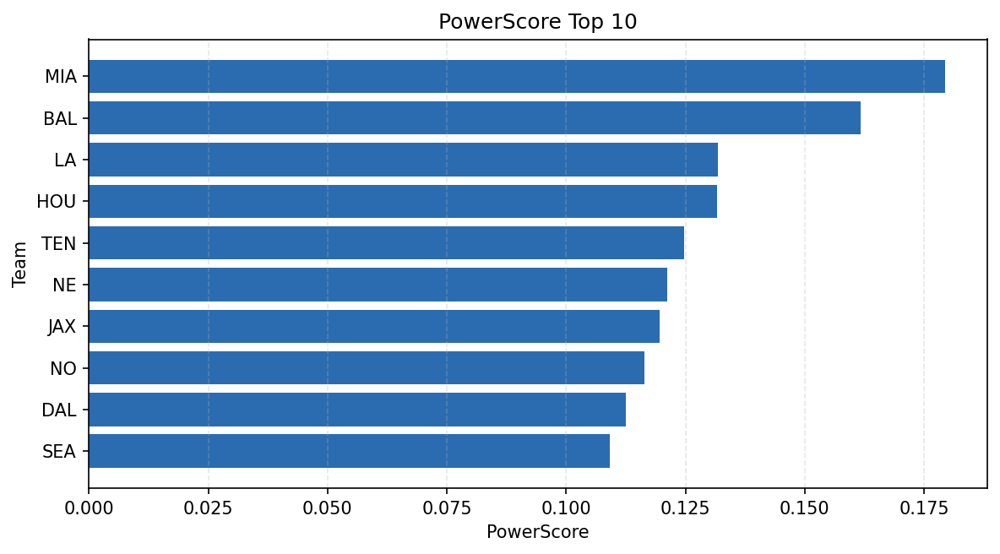

# Weekly Report - Season 2023, Week 6

_Generated at 2026-01-02T10:22:31.170600+00:00 (UTC)_

Data root: `data`

## Layer Shapes

| Layer | Artifact | Manifest | Rows | Columns | Status |
|-------|----------|----------|------|---------|--------|
| L1 Ingest | `data\l1\2023\6.parquet` | `data\l1\2023\6_manifest.json` | 2607 | 18 | ready |
| L2 Clean | `data\l2\2023\6.parquet` | `data\l2\2023\6_manifest.json` | 2607 | 24 | ready |
| L3 Team Week | `data\l3_team_week\2023\6.parquet` | `data\l3_team_week\2023\6_manifest.json` | 30 | 34 | ready |

## L2 Audit Snapshot

Last 3 entries from `data\l2_audit\2023\6_audit.jsonl`:

- {"step": "load", "details": "Loaded L1 parquet", "rows": 2607, "cols": 18, "timestamp": "2026-01-02T10:22:30.773965+00:00"}
- {"step": "prepare", "details": "Normalized team aliases, filtered season/week, deduplicated keys", "rows": 2607, "cols": 24, "rows_removed": 0, "timestamp": "2026-01-02T10:22:30.773965+00:00"}
- {"step": "validate", "details": "Validated against L2 contract and guardrails", "rows": 2607, "cols": 24, "timestamp": "2026-01-02T10:22:30.773965+00:00"}

## L3 Sanity

- Rows processed: 30
- Columns available: 34
- Artifact path: `data\l3_team_week\2023\6.parquet`

## Metrics Snapshot

### L4 Core12 Preview

- Artifact: `data\l4_core12\2023\6.parquet`
- Manifest: `data\l4_core12\2023\6_manifest.json`
- Rows: 30
- Columns: 27

| TEAM | core_epa_off | core_sr_off | core_sr_def |
| --- | --- | --- | --- |
| MIA | 0.1640774259077651 | 0.4880952380952381 | 0.38823529411764707 |
| BAL | 0.07234712590632791 | 0.5113636363636364 | 0.4594594594594595 |
| JAX | 0.06753565675340766 | 0.45348837209302323 | 0.3723404255319149 |
| LA | 0.05593599774874747 | 0.4583333333333333 | 0.35106382978723405 |
| DET | 0.03813143635446998 | 0.45977011494252873 | 0.36619718309859156 |

### PowerScore Rankings

- Artifact: `data\l4_powerscore\2023\6.parquet`
- Manifest: `data\l4_powerscore\2023\6_manifest.json`
- Rows: 30
- Columns: 4

| team | power_score |
| --- | --- |
| NO | 2.0378348923502663 |
| LV | 2.002006945599718 |
| NYG | 1.8789020069715117 |
| ATL | 1.839617565711678 |
| LAC | 1.7893465026659987 |
| NE | 1.7718968830298665 |
| BUF | 1.731231562966686 |
| PHI | 1.6935364206299541 |
| DAL | 1.6850421155726762 |
| DET | 1.670123960592273 |

## Visualizations

