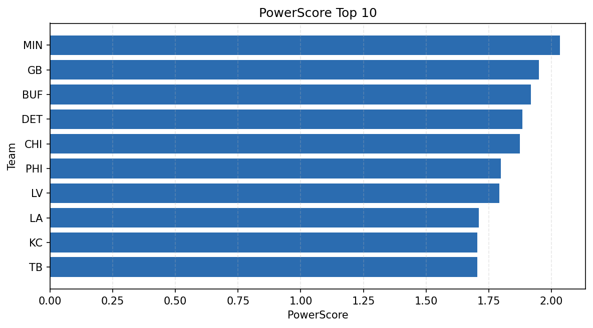

# Weekly Report - Season 2023, Week 7

_Generated at 2026-01-02T10:23:09.362362+00:00 (UTC)_

Data root: `data`

## Layer Shapes

| Layer | Artifact | Manifest | Rows | Columns | Status |
|-------|----------|----------|------|---------|--------|
| L1 Ingest | `data\l1\2023\7.parquet` | `data\l1\2023\7_manifest.json` | 2252 | 18 | ready |
| L2 Clean | `data\l2\2023\7.parquet` | `data\l2\2023\7_manifest.json` | 2252 | 24 | ready |
| L3 Team Week | `data\l3_team_week\2023\7.parquet` | `data\l3_team_week\2023\7_manifest.json` | 26 | 34 | ready |

## L2 Audit Snapshot

Last 3 entries from `data\l2_audit\2023\7_audit.jsonl`:

- {"step": "load", "details": "Loaded L1 parquet", "rows": 2252, "cols": 18, "timestamp": "2026-01-02T10:23:08.936679+00:00"}
- {"step": "prepare", "details": "Normalized team aliases, filtered season/week, deduplicated keys", "rows": 2252, "cols": 24, "rows_removed": 0, "timestamp": "2026-01-02T10:23:08.936679+00:00"}
- {"step": "validate", "details": "Validated against L2 contract and guardrails", "rows": 2252, "cols": 24, "timestamp": "2026-01-02T10:23:08.936679+00:00"}

## L3 Sanity

- Rows processed: 26
- Columns available: 34
- Artifact path: `data\l3_team_week\2023\7.parquet`

## Metrics Snapshot

### L4 Core12 Preview

- Artifact: `data\l4_core12\2023\7.parquet`
- Manifest: `data\l4_core12\2023\7_manifest.json`
- Rows: 26
- Columns: 27

| TEAM | core_epa_off | core_sr_off | core_sr_def |
| --- | --- | --- | --- |
| BAL | 0.3589953155007581 | 0.5211267605633803 | 0.38636363636363635 |
| KC | 0.20110538348286267 | 0.46987951807228917 | 0.3625 |
| CHI | 0.08810231488579037 | 0.45454545454545453 | 0.3717948717948718 |
| DEN | 0.08807561664204848 | 0.40789473684210525 | 0.43209876543209874 |
| NE | 0.07688988115344393 | 0.4868421052631579 | 0.4772727272727273 |

### PowerScore Rankings

- Artifact: `data\l4_powerscore\2023\7.parquet`
- Manifest: `data\l4_powerscore\2023\7_manifest.json`
- Rows: 26
- Columns: 4

| team | power_score |
| --- | --- |
| MIN | 2.034060565209909 |
| GB | 1.950837491142117 |
| BUF | 1.9186111300356987 |
| DET | 1.8842163837103558 |
| CHI | 1.8743790599677441 |
| PHI | 1.7985424830855499 |
| LV | 1.7912395649715784 |
| LA | 1.7104846089146435 |
| KC | 1.7050320722161552 |
| TB | 1.7043141797360428 |

## Visualizations

