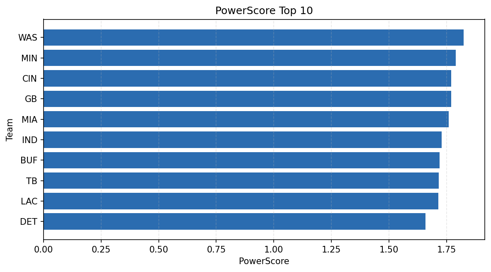

# Weekly Report - Season 2023, Week 8

_Generated at 2026-01-02T10:24:36.465696+00:00 (UTC)_

Data root: `data`

## Layer Shapes

| Layer | Artifact | Manifest | Rows | Columns | Status |
|-------|----------|----------|------|---------|--------|
| L1 Ingest | `data\l1\2023\8.parquet` | `data\l1\2023\8_manifest.json` | 2834 | 18 | ready |
| L2 Clean | `data\l2\2023\8.parquet` | `data\l2\2023\8_manifest.json` | 2834 | 24 | ready |
| L3 Team Week | `data\l3_team_week\2023\8.parquet` | `data\l3_team_week\2023\8_manifest.json` | 32 | 34 | ready |

## L2 Audit Snapshot

Last 3 entries from `data\l2_audit\2023\8_audit.jsonl`:

- {"step": "load", "details": "Loaded L1 parquet", "rows": 2834, "cols": 18, "timestamp": "2026-01-02T10:24:36.061941+00:00"}
- {"step": "prepare", "details": "Normalized team aliases, filtered season/week, deduplicated keys", "rows": 2834, "cols": 24, "rows_removed": 0, "timestamp": "2026-01-02T10:24:36.061941+00:00"}
- {"step": "validate", "details": "Validated against L2 contract and guardrails", "rows": 2834, "cols": 24, "timestamp": "2026-01-02T10:24:36.061941+00:00"}

## L3 Sanity

- Rows processed: 32
- Columns available: 34
- Artifact path: `data\l3_team_week\2023\8.parquet`

## Metrics Snapshot

### L4 Core12 Preview

- Artifact: `data\l4_core12\2023\8.parquet`
- Manifest: `data\l4_core12\2023\8_manifest.json`
- Rows: 32
- Columns: 27

| TEAM | core_epa_off | core_sr_off | core_sr_def |
| --- | --- | --- | --- |
| PHI | 0.2174025441345293 | 0.425 | 0.4888888888888889 |
| CIN | 0.20976390729610545 | 0.5641025641025641 | 0.4931506849315068 |
| NO | 0.20672246241985365 | 0.46511627906976744 | 0.3684210526315789 |
| DAL | 0.18494741073468837 | 0.4878048780487805 | 0.3625 |
| BUF | 0.07458580630901811 | 0.5116279069767442 | 0.38636363636363635 |

### PowerScore Rankings

- Artifact: `data\l4_powerscore\2023\8.parquet`
- Manifest: `data\l4_powerscore\2023\8_manifest.json`
- Rows: 32
- Columns: 4

| team | power_score |
| --- | --- |
| WAS | 1.8250144142485247 |
| MIN | 1.7905497690549992 |
| CIN | 1.7693483413103355 |
| GB | 1.7693088362443072 |
| MIA | 1.75967662619187 |
| IND | 1.7287568778918714 |
| BUF | 1.7202640084344951 |
| TB | 1.7160854330828434 |
| LAC | 1.7142028679759933 |
| DET | 1.6592897358298329 |

## Visualizations

